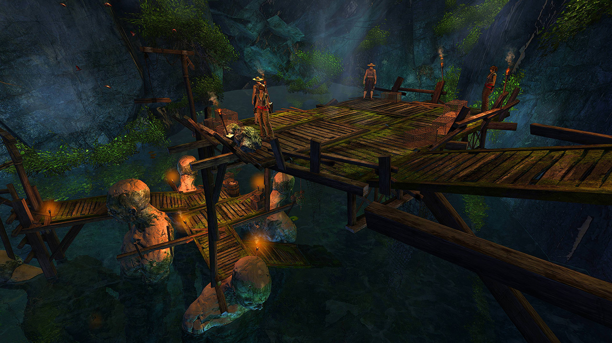
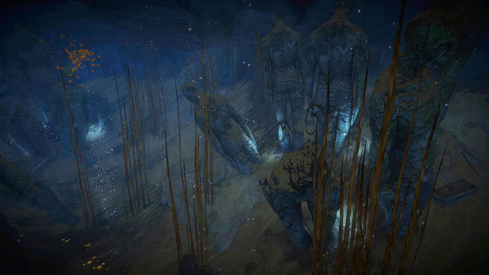
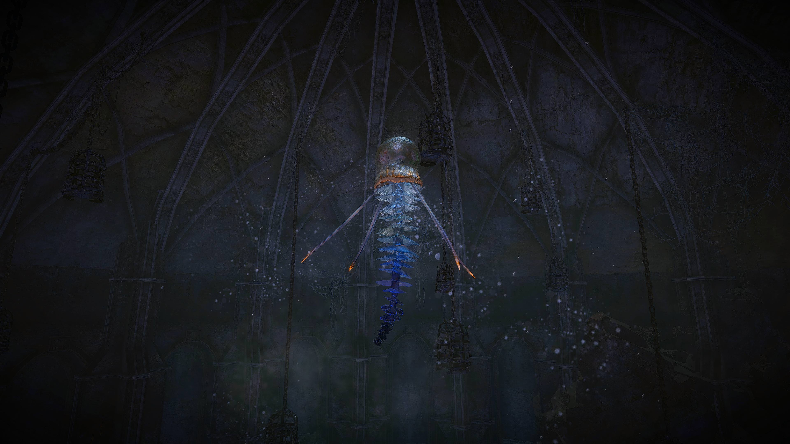

<Grid>

<GridItem sm="7">

<Warning >
This is an underwater fractal. Make sure you have appropriate underwater equipment with enough Agony Resistance.
</Warning>

It is highly recommended to bring one of the following builds due them performing well in underwater combat:

- <BuildLink specialization="Firebrand" build="Condi Firebrand"/>: high dps and easy access to <Boon name="Stability"/> and <Boon name="Quickness"/>
- <BuildLink specialization="Holosmith" build="Power Holosmith"/>: very high underwater dps
- <BuildLink specialization="Soulbeast" build="Power Soulbeast"/>: very high underwater dps and decent offensive capabilities
- <BuildLink specialization="Reaper" build="Power Reaper"/> or <BuildLink specialization="Scourge" build="Condi Scourge"/>: very high cleave
- <Specialization name="Tempest" text="Power Tempest" />: decent damage and cleave
- <BuildLink specialization="Chronomancer" build="Power Chronomancer"/>: very high single target dps, pulls.

</GridItem>

<GridItem sm="5">

</GridItem>
</Grid>

## Save the villagers <Item id="50082" disableText/><Item id="24658" disableText/>

<Grid>
<GridItem sm="7">

You can stack <Boon name="Might"/> on the rack before entering the water. Kill the two groups of Krait and open the cages. Use `/gg` after the last cage to resurrect at the tunnel part.

</GridItem>

<GridItem sm="5">
<Tabs>
<Tab specialization="reaper">
1.  <Skill name="Frozen Abyss"/> (Trident 5)
2.  <Skill name="Wicked Spiral"/> (Spear 2)
3.  Use both wells
4.  <Skill name="Soul Spiral"/> (Shroud 4)
5.  Shroud auto attacks until ~7k life force
6.  <Skill name="Wicked Spiral"/> (Spear 2)
7.  Auto attacks until spear 2 is off cooldown
8.  Repeat from step `1`
</Tab>
<Tab specialization="Weaver">

You can stay Weaver for this fractal and trait Air with <Trait id="232" disableText/>, <Trait id="214" disableText/> and most importantly <Trait id="1503"/> or re-trait to Tempest. For utility, use <Skill id="5638" disableText/>, <Skill id="40183" disableText/>, <Skill id="5539" disableText/> and <Skill id="43638"/> as Elite skill.

Rotate to <Skill name="Air Attunement" profession="Elementalist" disableText/> / <Skill name="Air Attunement" profession="Elementalist" disableText/> while swimming to the boss for <Trait name="Elements of Rage"/> and use <Skill name="Forked Lightning" profession="Elementalist"/> (Air autoattack) and <Skill name="Electrocute" profession="Elementalist"/> (Skill 2). Then rotate to <Skill name="Earth Attunement" profession="Elementalist" disableText/> / <Skill name="Air Attunement" profession="Elementalist" disableText/> use <Skill name="Rock Spray" profession="Elementalist"/> (Skill 2) and <Skill name="Sodden Swath" profession="Elementalist"/> (Earth/Air Skill 3) use <Skill name="Forked Lightning" profession="Elementalist"/> (Air autoattack) rotate to <Skill name="Fire Attunement" profession="Elementalist" disableText/> / <Skill name="Earth Attunement" profession="Elementalist" disableText/>. Use <Skill name="Boil" profession="Elementalist"/> (Skill 2) <Skill name="Molten Burst" profession="Elementalist"/> (Fire/Earth Skill 3) and <Skill name="Rock Anchor" profession="Elementalist"/> (Skill 4) <Skill name="Murky water" profession="Elementalist"/> (Skill 5). Rotate to <Skill name="Fire Attunement" profession="Elementalist" disableText/> / <Skill name="Fire Attunement" profession="Elementalist" disableText/> use <Skill name="LavaChains" profession="Elementalist"/> (Skill 4) and <Skill name="Heat Wave" profession="Elementalist"/> (Skill 5). Rotate to <Skill name="Air Attunement" profession="Elementalist" disableText/> / <Skill name="Fire Attunement" profession="Elementalist" disableText/> use <Skill name="Plasmic Strike" profession="Elementalist"/> (Air/Fire Skill 3), <Skill name="Electrocute" profession="Elementalist"/> (Skill 2) and <Skill name="Forked Lightning" profession="Elementalist"/> (Air autoattack). Rotate to <Skill name="Air Attunement" profession="Elementalist" disableText/> / <Skill name="Air Attunement" profession="Elementalist" disableText/> and start again.

Use your utility while in <Skill name="Fire Attunement" profession="Elementalist" disableText/> / <Skill name="Fire Attunement" profession="Elementalist" disableText/> or <Skill name="Air Attunement" profession="Elementalist" disableText/> / <Skill name="Air Attunement" profession="Elementalist" disableText/> when the vulnerability debuff is up (breaking out from the Jellyfish's belly).
</Tab>

<Tab specialization="tempest">

You can re-trait to Tempest for this fractal as it is one of the best choices for underwater combat (because of cleave and vulnerability uptime).

Trait Air with <Trait id="232" disableText/>, <Trait id="214" disableText/> and most importantly <Trait id="1503"/>. For utility, use <Skill id="5638" disableText/>, <Skill id="5539" disableText/>, <Skill id="30662" disableText/> and <Skill id="29968" disableText/> as Elite skill.

As rotation, alternate between <Skill id="29719"/> (<Skill id="5494" disableText/>) and <Skill id="5597"/> (<Skill id="5492" disableText/>) and <Skill id="5655"/> and Air autoattack (<Skill id="5494" disableText/>) to maximize DPS.
</Tab>

</Tabs>
</GridItem>

</Grid>

---

<Grid>
<GridItem>

## Dark Path <Label>Changes daily</Label>

If you get this path, swim together and take the _Luminous Plants_ on the way to protect you and nearby players from dying. If you are able to survive it, take the shortcut to the left after entering the larger cave. Use dodges or <Effect name="Invulnerability"/> for the last group of Krait. If someone reaches the krait champion, use `/gg` to immediately resurrect there.
</GridItem>

<GridItem>

## Dolphin Path <Label>Changes daily</Label>

If you get this path, spam `Skill 1` during swimming to reveal nearby hidden Krait and keep to the right. You can use `Skill 2` to create a distraction and `Skill 3` to get <Effect name="Stealth"/>. `Skill 5` can be used to instantly revive nearby dead allies. Always dodge **twice** when you anticipate a Krait attack. As soon as someone reaches the checkpoint you wait for your party to `/gg` and spawn next to you. Kill the Champion Krait to get to the Jellyfish Beast.

</GridItem>
</Grid>

---

<Grid>
<GridItem sm="7">

## Jellyfish Beast

The Jellyfish Beast does not have a breakbar since the rework. Instead a special version of <Effect name="Exposed"/> called Weakened is given to the boss. Sadly the <Item id="24868"/> does not work with this effect. Use <Item id="24615"/> and <Item id="24658"/> (Krait for the split phases) instead - when playing power based builds.

The boss always starts with an AoE stun-spin attack. <Boon name="Stability"/> spam is recommended to handle this encounter gracefully. Every now and then the boss eats a player. To free themselves, the player will need to complete a guitar-hero styled puzzle by always clicking the highlighted skill. If you miss the right skill too often you die.

Every 25% the boss gets <Effect name="Invulnerability"/> and Elite Krait spawn. Kill them to continue the fight.

When the <Instability name="Afflicted"/> is present, it is highly recommended to bring some kind of condition-cleanse due to the ticking aura during the split phases applying conditions.
</GridItem>

<GridItem sm="5">
<Tabs>
<Tab specialization="revenant">
Use <Skill name="Legendary Dwarf Stance"/> and <Skill name="Legendary Assassin Stance"/>. Use <Skill name="Legendary Demon Stance"/> instead of <Skill name="Legendary Assassin Stance" disableText/> if there is <Instability name="No Pain, No Gain"/>. When the Jellyfish raises all of it's tentacle cast <Skill name="Inspiring Reinforcement"/>.
</Tab>

<Tab specialization="Guardian">
Use <Skill name="Stand your ground"/>. If you have multiple Guardians in your team, consider taking <Skill id="43357"/>.
</Tab>
</Tabs>
</GridItem>

</Grid>

