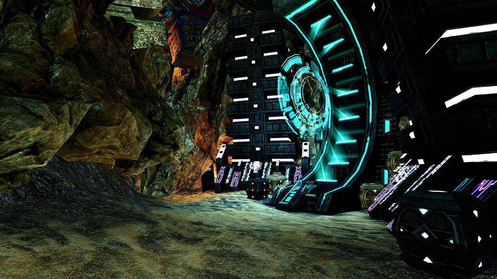
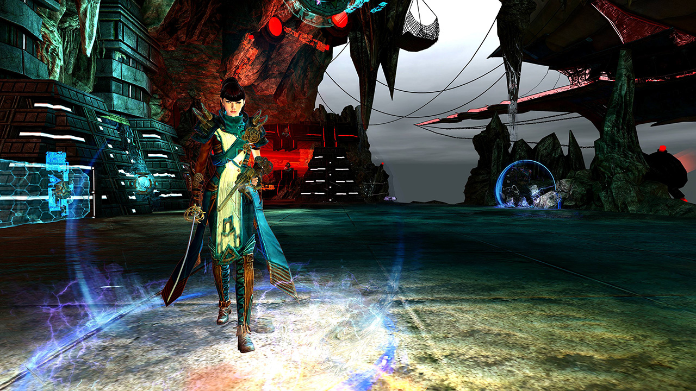

<Grid>
<GridItem sm="12">

## Start

Aggro the mobs and stack them on the corner. The _Champion Inquest Technician_ applies a group-wide <Control name="Daze"/> with his stunning shield, use <Boon name="Stability"/>, blocks or skills that make you invulnerable against it.

After you killed the mobs, use the _Mistlock Singularity_ to reset cooldown then the teleporter to enter the boss area.

</GridItem>

<GridItem sm="8">

<Tabs>
<Tab specialization="Weaver">
You can precast <Skill name="Conjure Fiery Greatsword"/> without it despawning early by placing a portal utilizing <Item id="78978"/> near the Mistlock Singularity and using it to return to the Mistlock Singularity for the precast before Mai Trin starts talking.
</Tab>
</Tabs>
</GridItem>

<GridItem sm="4">

</GridItem>
</Grid>

---

## Mai Trin <Item id="50082" disableText/>

<Grid>
<GridItem sm="7">
Mai Trin is protected by ten stacks of _Captain's Shield_, each stack reducing her incoming damage by 10%. The only way to remove stacks is by pulling her into electric fields from Horrik's alternating projectiles. Standing in the electric field will remove one stack per second from her. The fire field projectile from Horrik can be reflected and absorbed. You can easily recognize the projectile type from the icon above the targeted player.

The key is to stack on Mai Trin during the whole fight: this way she will always be in an electric field, even if she teleports to the furthest player away.

Every 25% health, Mai Trin disappears and additional enemies will spawn while fiery cannons start shooting. Change your target to Horrik and bring him down by 25% of his health to make Mai Trin return. Use <Control name="Pull"/>s to stack the adds together and cleave them down.

Keep in mind that with each phase more cannons start shooting at you, the fight can get quite chaotic in the last phases. Luckily, Mai Trin won't have any protective stacks below 25%, so focus your damage on Mai Trin. Killing Mai Trin finishes the fractal, therefore there is no incentive to kill Horrik before that. It is vital to bring reflections and <Boon name="Stability"/> to counter the elite adds that spawn after Mai Trin disappears at 25%.

<Tabs>
<Tab specialization="Revenant">
It is favorable to run <Skill name="Legendary Centaur Stance"/> for projectile absorption with <Skill name="Protective Solace"/> and condition cleanse with <Skill name=" Purifying Essence"/>. Alternatively, if more protection isn't needed, you can run <Skill name="Legendary Dwarf Stance"/> to give <Boon name="Stability"/> with <Skill name="Inspiring Reinforcement"/>. Do not forget that <Skill name="Warding Rift"/> (Staff 3) can block Horrik's projectile if you stand into it!
</Tab>

<Tab specialization="Soulbeast">
You can block Horrik's cannon projectile with <Skill name="Counterattack"/> (Greatsword 4).
</Tab>

<Tab specialization="Berserker">
Play Greatsword with <Skill name="blood reckoning"/> for maximum cleave with double <Skill name="arcdivider"/>.
</Tab>

<Tab specialization="Firebrand">
Bring <Skill name="mantraofliberation"/> and <Skill name="wallofreflection"/>. Coordinate with your <Specialization name="Renegade"/>! Use your pulls on <Skill name="Blazing Edge"/> and <Skill name="Chapter 3: Heated Rebuke"/> to stack up the additional adds.
</Tab>
</Tabs>

</GridItem>

<GridItem sm="5">

</GridItem>
</Grid>
