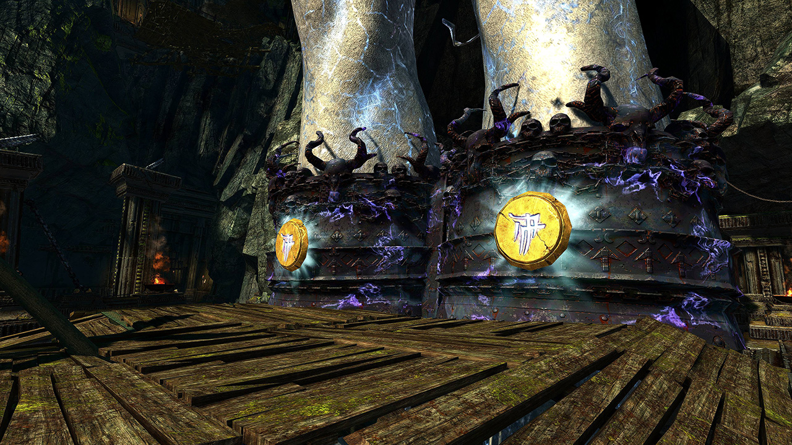
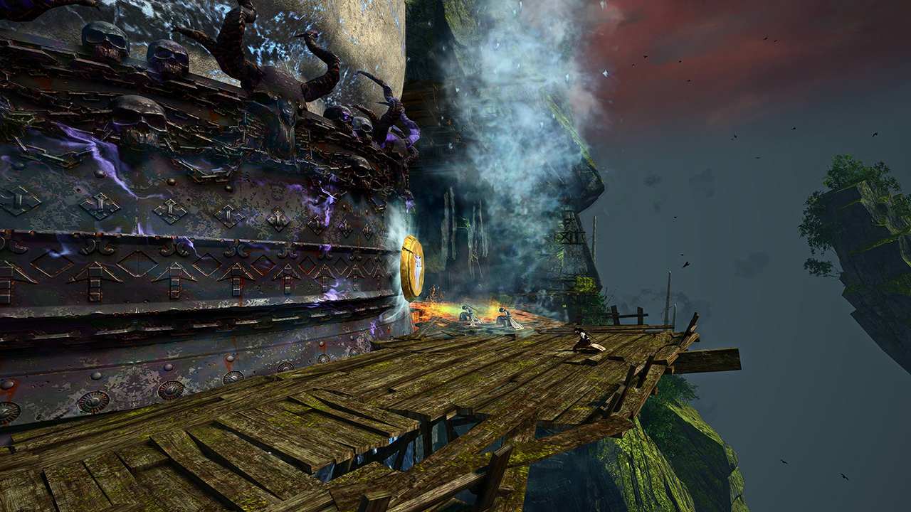
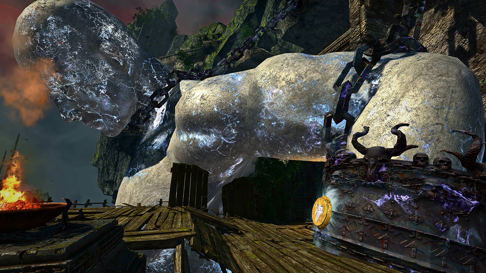
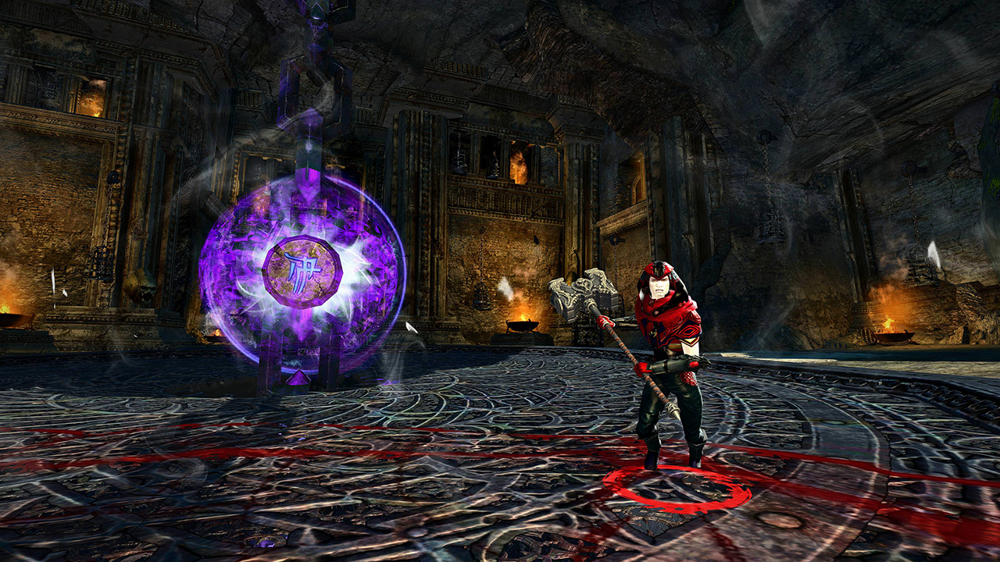

<Grid>
<GridItem sm="7">

## Start & Ankle Seals <Item id="8881" disableText/><Item id="24678" disableText/>

Kill the Cultists but take the _Cultist Hammer_ before finishing the last one to get a hammer charge.

Take the portal to above (...or walk) and destroy the two _Ankle Seals_ using hammer `Skill 4`. Both seals have to get hit two times, do not finish mobs unless you need a charge.

Use `/gg` afterwards and stay dead until the <Specialization name="Elementalist"/>, <Specialization name="Guardian"/>, <Specialization name="Thief"/> reaches the Chest Seal.

<Tabs>
<Tab specialization="renegade">
At the start, use <Item id="8764"/> and <Item id="8801"/> for <Effect name="Stealth"/> to prevent aggro from the mobs. Place <Item id="78978"/>, walk upstairs while the others kill the mobs and open the portal in front of the _Ankle Seals_.
</Tab>

<Tab specialization="elementalist">
<ProfessionVideo title="Skip to chest seal (same as guardian)" profession="Elementalist" timestamp="129" src="MmJTsOhdQeo"/>
After the <Specialization name="Renegade"/> or someone teleported the party up, the <Specialization name="Elementalist"/> waits at the gate for the others to finish the two seals, then rush upstairs.  
Keep walking until you reach the last wooden board, then `/gg` as well.
</Tab>

<Tab specialization="Guardian">
<ProfessionVideo title="Skip to chest seal" profession="Guardian" timestamp="129" src="MmJTsOhdQeo"/>
After the <Specialization name="Renegade"/> or someone teleported the party up, the <Specialization name="Elementalist"/> waits at the gate for the others to finish the two seals, then rush upstairs.  
Keep walking until you reach the last wooden board, then `/gg` as well.
</Tab>

<Tab specialization="Thief">
<ProfessionVideo title="Skip to ankle seal" profession="Thief" timestamp="70" src="Alpgs_GaZV0"/>
After the <Specialization name="Renegade"/> or someone teleported the party up, the <Specialization name="Elementalist"/> waits at the gate for the others to finish the two seals, then rush upstairs.  
Keep walking until you reach the last wooden board, then `/gg` as well.
<ProfessionVideo title="Skip to chest seal" profession="Thief" timestamp="86" src="Alpgs_GaZV0"/>
</Tab>
</Tabs>

</GridItem>

<GridItem sm="5">

</GridItem>
</Grid>

---

<Grid>
<GridItem sm="5">

</GridItem>

<GridItem sm="7">

## Chest Seal <Item id="8881" disableText/><Item id="24678" disableText/>

As soon as the <Specialization name="Elementalist"/> did `/gg` too, everyone can resurrect and will respawn in front of the _Chest Seal_ with a new _Cultist Hammer_ ahead of you.

It will take five hits to break the chest seal. If you see somebody running ahead and placing a <Item name="whitemantleportaldevice"/> to the _Arm Seals_, try to get a hammer charge before taking it to above. In an ideal scenario the group kills the cultists one by one and uses every charge gained so that no time is lost due to waiting for respawns. This implies, that the party can run a healer to better sustain the damage - with no penalty in speed for this encounter.

<Tabs>
<Tab specialization="renegade">
Take <Skill name="Legendary Demon stance"/> and spam <Skill name="Pain absorption"/> for <Boon name="Resistance"/> and condition cleanse on party.

After 2-3 hits against the Seal, place <Item id="78978"/>, run up to the _Right Arm Seal_, wait for the destruction of the _Chest Seal_ then open the portal for the party.
</Tab>

<Tab specialization="soulbeast">
<Skill id="12638"/> from an offhand Axe helps pulling the Cultists to you. Take <Skill id="12489"/> for pulsing condition cleanse! Great way the clean the huge stacks of <Condition name="Burning"/>. You can also take <Skill name="Bear stance"/> with the trait <Trait name="Leader of the Pack"/> to give the whole party condition cleanse.
</Tab>
</Tabs>
</GridItem>
</Grid>

---

<Grid>
<GridItem sm="7">

## Arm Seals <Item id="8881" disableText/><Item id="24678" disableText/>

This is a matter of timing, so look out for the <Item id="78978"/> and the hammer carrier. In a perfect world you use the portals one by one, and <Specialization name="Renegade"/> placing <Skill name="Inspiring Reinforcement"/>, giving <Boon name="Stability"/> to the hammer carrier and not getting knocked back, resulting in faster seal breaking.

During the portal jumping, keep Cultist's health as low as possible but **only finish them when a hammer charge is needed**. If you run out of portals simply run together. Ideally, both seals take three hits to be destroyed—two portals are more than enough.

Type `/gg` after finishing both seals and stay dead. If you wipe before both seals are destroyed, they will reset to full health.

<Tabs>
<Tab specialization="berserker">
You can take the _Cultist Hammer_ and use <Skill id="21815"/> during the portal jumping to nullify the high incoming damage. Make sure to grab a greatsword for <Skill name="arcdivider"/>.
</Tab>

<Tab specialization="soulbeast">
Again, <Skill id="12638"/> on offhand Axe helps pulling the Cultists to you.
</Tab>
</Tabs>
</GridItem>

<GridItem sm="5">

</GridItem>
</Grid>

---

<Grid>
<GridItem sm="7">

## The way up

Do not resurrect yourself yet, wait for the <Specialization name="Revenant"/>, <Specialization name="Elementalist"/>, <Specialization name="Guardian"/> or <Specialization name="Thief"/> to finish his portal and do `/gg` himself again or you will be stuck with a useless person for the entire end fight.

After the whole party `/gg`'ed, resurrect and place <Item id="78978"/> at the revival position. Blink up, and open the portal. Note that after the _Status Reset_ change you cannot blink up and `/gg` anymore, since it will clear the portal.
</GridItem>

<GridItem sm="5">
<Tabs>
<Tab specialization="renegade">
<ProfessionVideo title="Skip to endboss" profession="Revenant" src="-zJLBwkO1Cg"/>
</Tab>

<Tab specialization="elementalist">
<ProfessionVideo title="Skip to endboss" profession="Elementalist"  src="OjUvCp2h_04"/>
</Tab>

<Tab specialization="Guardian">
<ProfessionVideo title="Skip to endboss" profession="Guardian"  timestamp="162" src="MmJTsOhdQeo"/>
</Tab>

<Tab specialization="Thief">
<ProfessionVideo title="Skip to endboss" profession="Thief"  timestamp="125" src="Alpgs_GaZV0"/>
</Tab>
</Tabs>
</GridItem>
</Grid>

---

<Grid>
<GridItem sm="6">

## Arch Diviner <Item id="8881" disableText/><Item id="24678" disableText/>

Take the portal up and start the fight against the Arch Diviner. His defiance bar appears very shortly but frequently, try to break it as often as possible to benefit from <Effect name="Exposed"/>.

Every 25% of his health, you will need to collect a _Cultist Hammer_ charge similar to before by killing one of the four spawned Cultists and hit the final Seal to make the Arch Diviner vulnerable again. Cultists apply a lot of conditions so kill them fast and try to stay out of their aggro range.

Do not get caught in any of the Arch Diviner's voidzones, otherwise you will be teleported and trapped inside a distant cage which messes up positioning. Also, try to stack on him as he teleports to the furthermost person.

<Tabs>
<Tab specialization="revenant">
Use <Skill name="Inspiring Reinforcement"/> in <Skill name="Legendary Dwarf Stance" disableText/> for <Boon name="Stability"/> against the <Control name="Knockdown"/> the boss does after every seal break phase.
</Tab>
</Tabs>
</GridItem>

<GridItem sm="6">

</GridItem>
</Grid>
