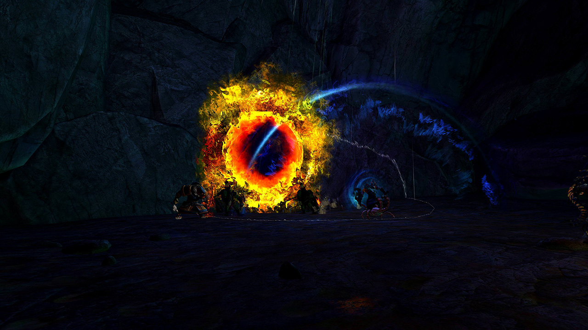
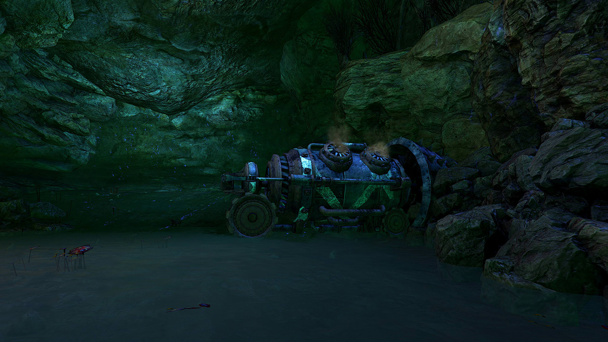
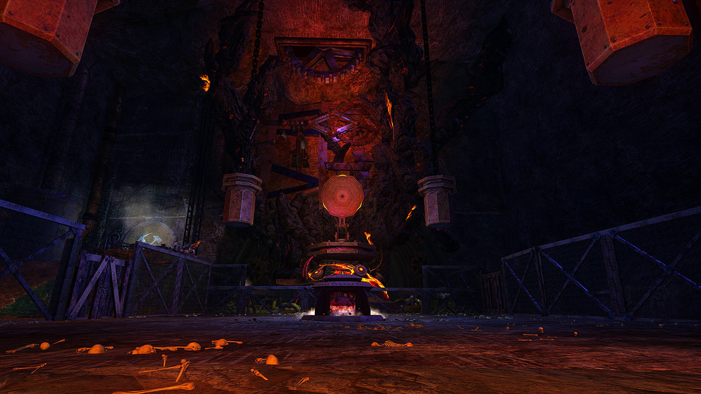

<Grid>
<GridItem sm="6">
## Starting area and the tunnel

Go to Rox and Braham, wait for the mobs to spawn, kill them. After killing them, proceed into the tunnel, there are 5 caves in the tunnel, each having a group of mob in it, after killing the mobs, destroy the _Boulder_ that becomes damageable (a red gear indicates it's place). After killing all 5 group of mobs and destroying all 5 _Boulders_ on the red gears you wait for the Drill to make it's way out of the tunnel (which should already be done).
</GridItem>

<GridItem sm="6">

</GridItem>
</Grid>

---

<Grid>
<GridItem sm="6">

</GridItem>

<GridItem sm="6">
## On your way to the Boss

Exit the tunnel and kill the group of mobs coming towards you. Then proceed to the Steam Walls. The first Steam Wall is impassable, wait until it lowers before moving on. Each Steam Wall will knock you back and damage you. After the first wall, you can now pass the Steam Walls by walking backwards through them or using <Boon name="Stability"/>. Do not pass through them with low HP, as this can down you or kill you. Once through the walls, make your way to the weapon testing arena.
</GridItem>
</Grid>

---

<Grid>
<GridItem sm="5">
## Weapon Testing Arena

After entering the arena (and at each new phase), 2 Champions spawn, which your party needs to separate and kill. Not separating them will cause them to reflect damage back to the attacker via a unique buff called [Sentinel Retribution](https://wiki.guildwars2.com/images/b/b5/Sentinel_Retribution.png).

At the same time, you will survive a series of weapons tests.

The weapon test types include:
</GridItem>

<GridItem sm="7">

</GridItem>

<GridItem sm="6">

**Fireball Barrage**

You have to avoid, block or reflect the Fire Barrage falling on you, place reflect (<Specialization name="Guardian"/> with <Skill name=" Wall of Reflection"/> ) or absorb (<Specialization name="Revenant"/> <Skill name="Legendary Centaur Stance"/> with <Skill name="Protective Solace"/>) in the middle of the AoE to absorb the projectile. The projectile leaves behind an AoE that applies <Condition name="Burning"/>. After surviving the test you can damage 25% of the _Thermal Core_.

**Fire Tornadoes**

You have to dodge, avoid, or negate the Fire Tornadoes coming towards you. The Tornadoes damage you, apply <Condition name="Burning"/> and knockback. <Boon name="Stability"/> is useful here to avoid knockback. Please note that since the rework, the Fire Tornadoes **go through** the _Thermal Core_. After surviving the test you can damage 25% of the _Thermal Core_.

</GridItem>

<GridItem sm="6">

**Shockwaves**

You have to dodge, block or jump over the shockwaves coming towards you. The shockwaves apply <Control name="Knockdown"/>. <Boon name="Stability"/> is useful here to avoid being knocked down, but you will still take damage. After surviving the test you can damage 25% of the _Thermal Core_.

  
  

**25% Phase**

At 25% the same weapon's test will be active, though now all 3 weapon test types will happen at once. Simply damage the core as fast as possible to move on to the final boss fight.

</GridItem>
</Grid>

## Final Boss

After you killed the _Thermal Core_ the Weapons Test Engineer and 2 champions come down. Again, separate the adds from each other and the boss to avoid reflective damage. Kill the champions on the sides first quickly, as the boss will continue attacking as you deal with the adds. Now focus the boss.

The Weapons Test Engineer gets <Effect name="Invulnerability"/> every 25%, does a telegraphed AoE attack that inflicts 10 stacks of <Condition name="Bleeding"/> and moves to one of the 4 spots in the middle of the 4 walls. It may also stay where it was, as the movement is random. Bursty condition damage can be effective on this boss, as it does not cleanse conditions when going invulnerable, meaning they will still tick while it moves to the next area. Kill the boss to finish the fractal.
