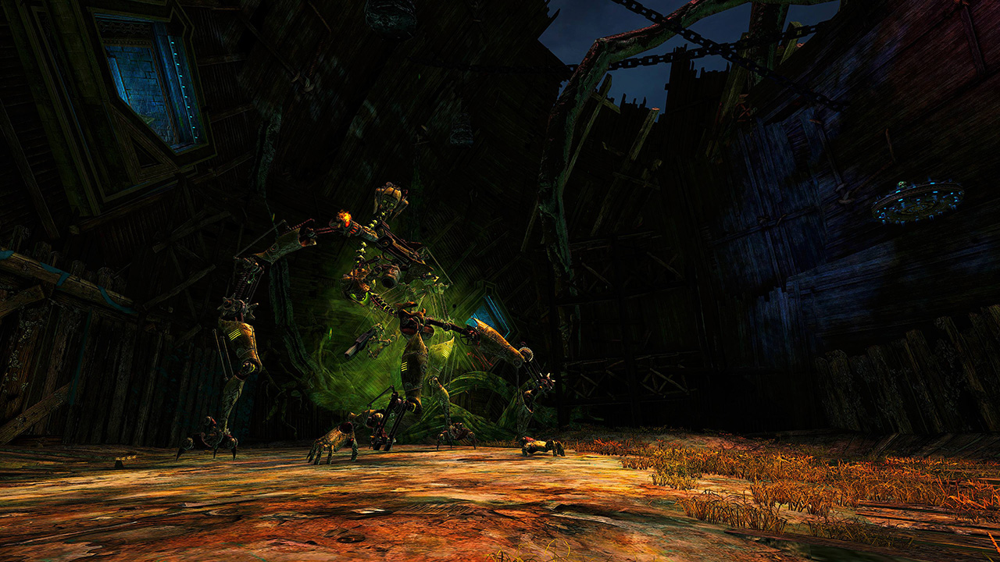
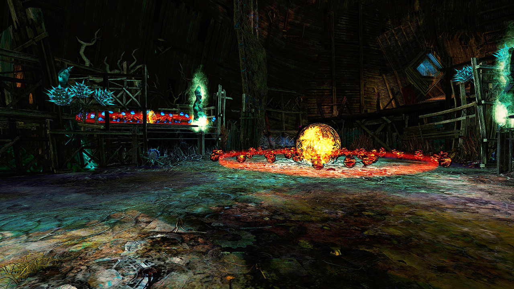
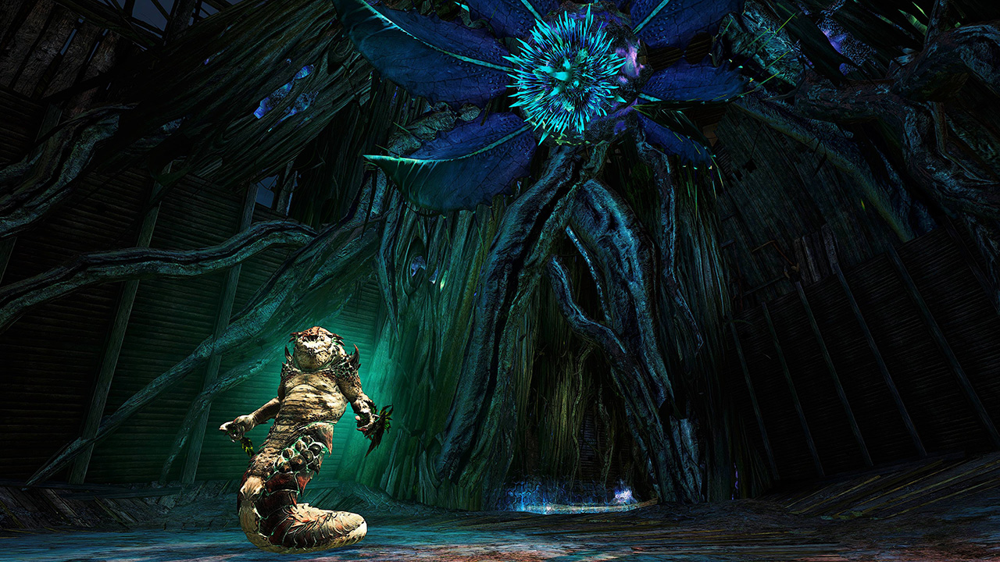
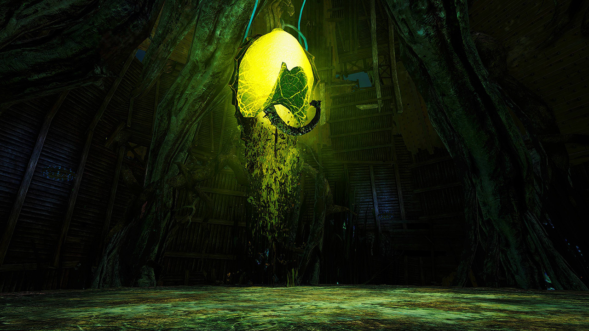

---
potions:
  - id: 50082
hasCM: false
cycle: Day
layout: src/layouts/Fractal.astro
date: "2023-08-07T08:42:21.112Z "
title: Nightmare
difficulties:
  - level: 98
    ar: 147
consumables:
  - 43360
  - 8764
  - 8801
  - 78978
record:
  time: 5 min 44 sec
  by:
    - name: Invicta Luna
      tag: iV
  youtube:
    - id: DYP_RuapR8c
      name: Delay
      specialization: Soulbeast
    - id: UlPsUMH7vZE
      name: BlackHawk
      specialization: Soulbeast
    - id: SIdcWSGkL-M
      name: Cloyd
      specialization: Berserker
    - id: JONEqZ9rARM
      name: Tantor
      specialization: Guardian
    - id: x_2ahQx_QDQ
      name: Pineapple
      specialization: Renegade
long_description: ""
image: images/header_old.jpg
api: 3177
bosses: 3
description: I am...awake. I am aware. Suffer, mortal things.
group: Challenge Mode
sigils:
  - id: 24615
  - id: 24868
  - id: 24658
    description: after MAMA
---

## Assault Knights <Item id="50082" disableText/>
<Label>426,071 HP</Label>

<Grid>
<GridItem sm="7">
Stack <Boon name="Might"/> before jumping down. Kill the three _Assault Knights_ (Red, Blue and Green), each of them has the same set of abilities: a PBAoE <Control name="Knockdown"/> and an AoE <Control name="Pull"/> which covers the entire room except the knight's position, both can be dodged.

Break their defiance bars, kill them to awaken MAMA and use `/gg` to reset your cooldowns. Ideally the group splits up here and kills the knights simultaniously.
</GridItem>

<GridItem sm="5">

</GridItem>
</Grid>

## MAMA <Item id="50082" disableText/><Item id="43360" disableText/> 
<Label>5,200,519 HP</Label> <Label>CC mama: 1800, CC adds: 800</Label>

Stack <Boon name="Might"/>, <Boon name="Quickness"/> and <Boon name="Alacrity"/> before jumping down. In organized teams use a <Item name="watchworkportaldevice"/> to teleport from the mistlock to MAMA.

The duration of the encounter heavily relies on how quickly your party can break the defiance bars throughout the fight, in addition to the amount of damage your party can generate in each phase. This is an average clear time and can be reached by organized teams as well as pick up groups. The class outlines below will be suitable for faster and slower kills as well.

MAMA will arise, after being invulnerable for a few seconds its first attack will be a _spinning <Control name="Knockback"/>_. This one should be interrupted by CCing the boss fast enough. The consecutive spin attacks should be taken care of by the <Specialization name="Firebrand"/> as long as there is not to much AoE, that potentially removes <Boon name="Aegis"/> is around. This spin attack always hits on the _second_ spin animation.

Apart from that, turn away from your party members shortly before the _Vomit Toxin_ hits (orange cone), otherwise you will 'infect' party members in front of you with it.

Every 25%, MAMA gets <Effect name="Invulnerability"/> and an _Assault Knight_ (similar to the knights before) will spawn. Quickly break their defiance bar and burst them down as MAMA will continue it's attacks.

When MAMA reaches 33%, it conjures a large _Nightmare Miasma_ field around it which deals enormous damage. It will also become mobile, start jumping to players, offloading shockwaves which <Control name="Knockdown"/> and attacking with <Control name="Stun"/> cones. It is especially important to immediately kill the last _Assault Knight_ at 25% health.

Fast crowd control and animation knowledge are the keys to this fight.

---

<Grid>
<GridItem sm="8">

## First set of altars <Item id="50082" disableText/><Item id="24658" disableText/>

Swap your weapon set to <Item name="Impact"/> and <Item name="Serpentslaying"/>. You need to cap two altars to continue. Pull the two groups of Krait back to the passage and kill all enemies there. Start capping the altars as soon as possible, but keep in mind that standing inside puts <Effect name="Agony"/> on yourself. Only enemy Krait counteract the capping here, you can ignore the Hallucinations.  
Learn the _Red Orb_ patterns as they can quickly kill you, _Blue Orbs_ will heal you for a large amount of health (even with Agony).  
On a side note, more players do not cap an altar faster. More than one person standing inside is redundant.

<Tabs>
<Tab specialization="Berserker">
Exchange <Skill name="signetofmight"/> or <Skill name="forgreatjustice"/> for <Skill name="on my mark" profession="Warrior"/> and already swap to your weapon sets with Superior Sigil of Serpent Slaying.

At the first set of altars draw the Elite Nightmare Hypnoss with <Skill name="on my mark" profession="Warrior"/> to the narrow corridor so that the <Specialization name="Firebrand"/> can pull them together with <Skill name="Binding Blade"/> and disable them with <Skill name="Tremor" profession="Warrior"/>. Assist in killing the Elite Nightmare Hypnoss and capturing one of the two altars.
</Tab>
</Tabs>
</GridItem>

<GridItem sm="4">

</GridItem>
</Grid>

## Second set of altars <Item id="50082" disableText/><Item id="24658" disableText/>

<Grid>
<GridItem>
<Card title="Variant 1: PuG variant, pulling all mobs">
Again, pull all enemies to the center (wait for the <Specialization name="Firebrand"/> to cast <Skill id="9147"/>) and kill them there. The mobs at the left altar (West) can be aggroed with a simple projectile, the mobs on the right side (East) need to be pulled with <Skill id="14381"/> (Longbow), <Skill id="14575"/>, <Skill id="5491"/> (Staff) or by teleporting up and jumping down.

Both side altars can easily be capped by a single person after another player has pulled down the mobs. Please note that you have to wait until the mobs are down before teleporting elsewhere to prevent them from running back.
</Card>
</GridItem>

<GridItem>
<Card title="Variant 2: Organized fast variant">
The group splits up, so that a team of 2 and 3 will cap each altar. While running up stick to the very wall farthest away from the mobs in the center to avoid pulling them. Use <Item name="harpyfeathers"/> if necessary.

Pull out the mobs of the side altar circles, kill them and quickly cap. One person is supposed to aggro the remaining mobs in the center circle, so that the party can cap now without any interferance.
</Card>
</GridItem>

</Grid>

Contrary to the first set of altars, respawning _Veteran Hallucinations_ counteract capping here. Use <Control name="Pull"/> to grab them out of the central altar and always have a positive amount of players inside.

After you capped all three altars, use `/gg` immediately if someone in the party needs it, then you can continue up to the 2nd boss. Before the ramp up, a group of Krait will attack you - simply keep walking to skip them. Use dodges, evades or skills that make you invulnerable to get through the cascading orbs and disable them by walking through the orb at the top of the ramp.

Usually a single person with high mobility (<Specialization name="Warrior"/>, <Specialization name="Dragonhunter"/>, <Specialization name="Soulbeast"/>, <Specialization name="Weaver"/>) and <Item id="85244"/> or <Item id="49940"/> skips to Siax while the rest of the party stays dead. Trigger Siax and wait for Siax to appear, then `/gg` as well.

<Tabs>
<Tab specialization="Weaver">
Use <Skill id="5536"/> to teleport up to the altars.

You can pull both sides with <Skill id="5491"/> (for the right side, jump at the end of your [cast](https://www.youtube.com/watch?v=lNZEM9StauU)).

If the person who pulled your side ported up the other side to fast and the mobs come back use <Skill id="5683"/> and <Skill id="5686"/> to prevent them from reaching the circle before it is tabbed. Make sure you are attuned correctly for this in time.
</Tab>

<Tab specialization="Firebrand">
Use <Skill name="Binding Blade"/> and <Skill name="tomeofjustice"/> to pull adds.

Use tome of courage skill 4 to give resistance.
</Tab>

<Tab specialization="Berserker">
At the second set of altars, wait for your <Specialization name="Firebrand"/> to pull them together with <Skill name="Binding Blade"/> and disable the Elite Nightmare Hypnoss with <Skill name="Tremor" profession="Warrior"/>. Immediately move close to the altar on the right side and pull the Elite Nightmare Hypnoss occupying the altar to the mid by using <Skill name="on my mark" profession="Warrior"/>. Assist in killing the remaining Elite Nightmare Hypnoss and capture the mid altar respectively.
</Tab>

<Tab specialization="Dragonhunter">
Use <Skill name="Binding Blade"/> and <Skill name="Dragonsmaw"/> excessively to pull as many mobs as possible.

At the second set of altars use your <Skill name="Huntersverdict"/> to pull out the Elite Nightmare Hypnoss occupying the center circle. Make sure, that there are no projectile blocking Skills from enemies present.
</Tab>
</Tabs>

---

## Siax the Corrupted <Item id="50082" disableText/><Item id="43360" disableText/> 
<Label>6,138,797 HP</Label> <Label>CC: 2000</Label>

Stack <Boon name="Might"/>, <Boon name="Quickness"/> and <Boon name="Alacrity"/> before approaching the red orb and starting the fight. In organized teams use a <Item name="watchworkportaldevice"/> to teleport from the mistlock to Siax.

The duration of the encounter heavily relies on how much damage your group can generate in each phase and how quickly you can finish the adds. This is a rather fast clear time and can be reached by organized teams. Pick up groups might have a hard time reaching this duration, however the class-outlines below are still suitable for slower kills.

During the fight, break his defiance bar (2000 CC damage) as fast as possible to interrupt his _Caustic Explosion_ skill. Siax will wipe your party if you fail to interrupt it with enough crowd control. Pay attention to his bouncing orb barrages, the _Vomit Toxin_ and the exploding _Volatile Hallucinations_ (below 75% health). Do not stand in the red PBAoE when the inner circle reaches the outer to avoid spawning a _Nightmare Hallucination_. Watch your buffs: the <Specialization name="Firebrand"/> should give you <Boon name="Aegis"/>, which blocks this attack and requires no further action from your side.

Attention! In average groups 5 _Volatile Hallucinations_ will spawn in various locations around the arena. Each of them will target the closest player and apply a tether-like effect on them effectively making visible to who they are targeted on. Approaching the add will cause it explode the moment it reaches melee range which will cause <Control name="Daze"/> and apply conditions to all players in it's explosion radius. However the add will not explode if it's killed while it's target is outside of the explosion radius. A good practice is to move to the opposite side of the boss and let the add walk through the hitbox. This will cause the add to die by cleave before it reaches it's target, neutralizing the threat.

When Siax reaches 66% health, he gains <Effect name="Invulnerability"/> and four _Echoes of the Unclean_ will spawn in the North, East, South and West which need to be killed quickly to interrupt his _Caustic Explosions_. The same occurs at 33%, though the adds will have their spawning positions shifted clockwise.

Assign players to each add before the fight starts by setting waypoints. In PuGs the <Specialization name="Firebrand"/> and <Specialization name="Renegade"/> will usually focus on one mob together due to their lower DPS.

## Ensolyss of the Endless Torment 
<Label>14,059,890 HP</Label> <Label>CC phase 1: 2000 </Label> <Label>CC phase 2: 2250 </Label>

<Grid>
<GridItem>

<Information>
This boss heavily favours condition damage!
</Information>

Walk through the teleporter and trigger Ensolyss once after defeating Siax to gain the new checkpoint and use `/gg` to reset all cooldowns. Stack <Boon name="Might"/>, <Boon name="Quickness"/> and <Boon name="Alacrity"/> before starting the fight. Good teams will use a <Item id="78978"/> to teleport to the boss. When you start the fight don't stand in the center area of the platform or you will receive a <Control name="Knockback"/>. Right after he looses his <Effect name="Invulnerability"/> there is a CC bar. This bar is only breakable for approximately one second. Time your CC wise.

Nearly all of Ensolyss' attacks do a <Control name="Knockback"/> or <Control name="Pull"/>, learn to dodge or walk out of every attack. The most dangerous one is his shockwave-shatter combo, he smashes down a stunning yellow shockwave (like MAMA below 33% health), spawns hallucinations on each players position and shatters them after two seconds.

Again, the key to this fight is fast crowd control. Break his defiance bar quickly to interrupt his high damage attacks. Always stack around the center area and do not try to follow him to the edge as he will simply teleport back most of the time.
</GridItem>

<GridItem>

</GridItem>
</Grid>

### Orb phases <Label>66%, 33%</Label>

At 66% and 33%, Ensolyss will teleport to the middle and gain <Effect name="Invulnerability"/>. Your party will need to split up and cap five altars, similar to the ones before.\
_Red Orbs_ and stunning shockwaves emerge from the middle, learn the patterns to avoid any damage. Try to catch the _Blue Orbs_ as they heal you for a significant amount. Note that _Blue Orbs_ only spawn at 66% if all altars are capped as fast as possible.

After the orb phases, the defiance bar needs to be broken immediately to prevent Ensolyss from knocking everyone off the platform. His defiance bar will recover shortly after being broken for the first time, break it a second time (especially at 33% health) to further prevent his attacks and deal more damage thanks to <Item id="24868"/> and <Trait id="1502"/>.

Below 66%, Ensolyss gains a new ability where he smashes two quarters of the platform subsequently and knocks everyone inside the **orange** areas off the platform, similar to the skill immediately after the orb phases. It it safe to stand inside the **purple** areas.

Below 33%, he may summon a special shockwave which travels inwards to him (contrary to the ones before) and deal enormous damage to everyone near him. With enough crowd control and DPS this should never occur.

### Final phase <Label>\<15%</Label>

When Ensolyss reaches 15% health, he will stop using his usual attacks, but only a small bubble in the middle will protect you from his deathly rain. Krait will charge through the middle (indicated by large arrows on the ground) and make positioning harder, kill Ensolyss quickly to finish the fractal.
