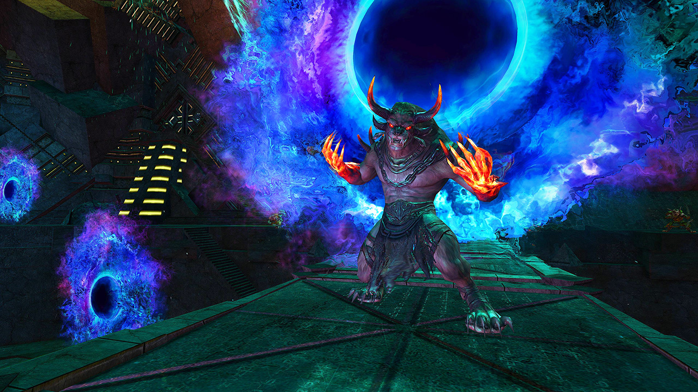
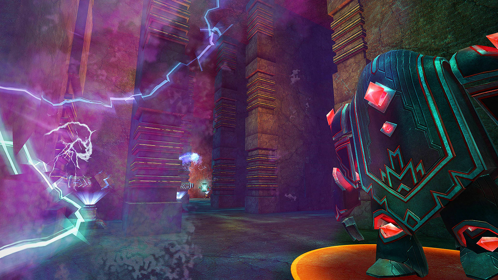
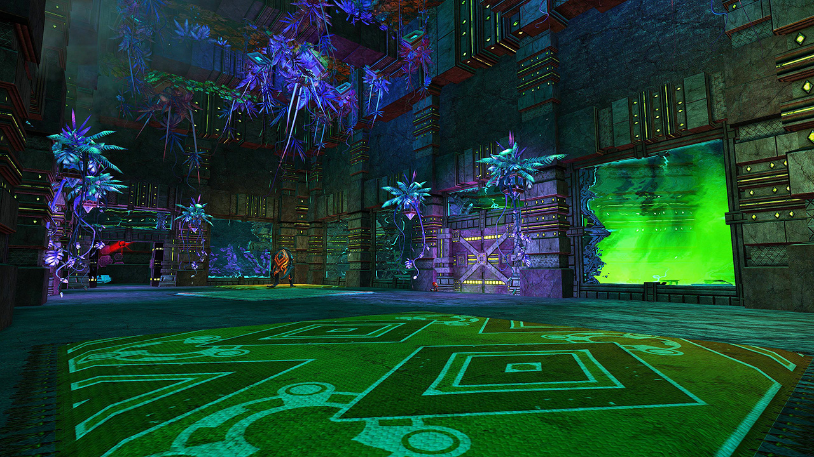
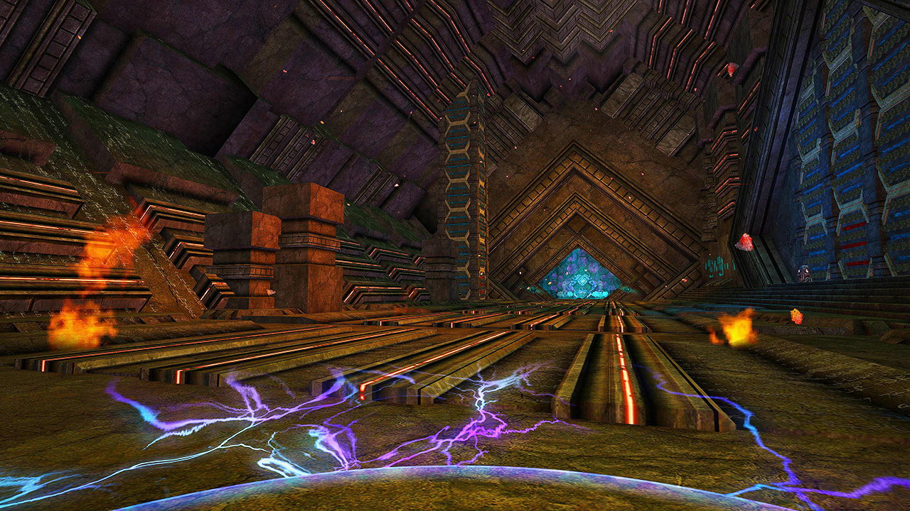
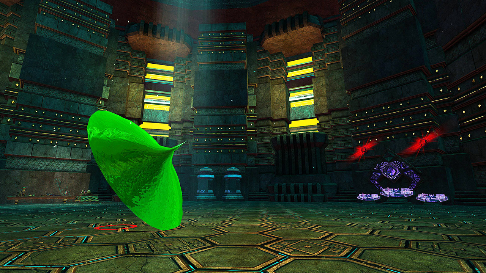
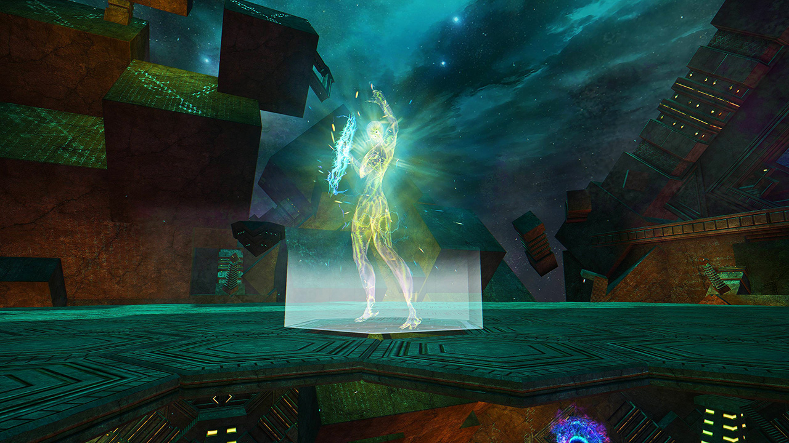

<Grid>
<GridItem xs="12" sm="8">

## Start

Activate the _Detonator_ and wait for the <Specialization name="Renegade"/>, <Specialization name="Weaver"/>, <Specialization name="Guardian"/> or <Specialization name="Daredevil"/> to open a portal with <Item id="78978"/> (the rest of the group stacks <Boon name="Might"/> in the vestibule) or if no one can skip just walk up to the _Elite Flame Legion Fire Shaman_. Kill him, `/gg` to reset your cooldowns and split up to disable the four colliders.

<Tabs>
<Tab specialization="Renegade">
<ProfessionVideo title="First skip" profession="Revenant" src="lEdoox14vME"/>
</Tab>

<Tab specialization="Weaver">
<ProfessionVideo title="First skip" profession="Weaver" timestamp="8" src="OjUvCp2h_04"/>
</Tab>

<Tab specialization="Guardian">
<ProfessionVideo title="First skip" profession="Guardian" timestamp="480" src="MmJTsOhdQeo"/>
</Tab>

<Tab specialization="Daredevil">
<ProfessionVideo title="First skip" profession="Thief" timestamp="217" src="Alpgs_GaZV0"/>
</Tab>
</Tabs>
</GridItem>

<GridItem xs="12" sm="4">

</GridItem>

</Grid>

---

<Grid>
<GridItem xs="12" sm="12">

<Warning>
For a faster completion time you can split up. <Specialization name="Berserker"/> activates Subject 6 <Label>Northwest</Label>. <Specialization name="Guardian"/> solos Repulsor lab<Label>South</Label>. <Specialization name="Weaver"/> solos Superheated Room <Label>West</Label> and <Specialization name="Renegade"/> and <Specialization name="Soulbeast"/> do Researcher Dormitories <Label>East</Label>.
</Warning>
</GridItem>

<GridItem sm="6">

## 1. Room: Repulsor lab <Label>South</Label>

This should be done by two people, **but can be soloed (usually by <Specialization name="Guardian"/>) as shown in the video below**. Learn the timing of the turret shots and jump or dodge over them. You can also take a _Safety Shield_ from the beginning and use it to block shots for a short duration.

One person activates the console to the left <Label>1</Label> to grant the other person short access to the console at the right <Label>2</Label>.

Activating <Label>2</Label> enables short access to the two final consoles at <Label>3</Label>. You can bypass the <Condition name="Immobile"/> from triggering them by standing exactly in the middle and pressing both buttons at the same time.

<ProfessionVideo title="Repulsor lab solo (any class)" profession="Guardian" timestamp="545" src="MmJTsOhdQeo"/>
</GridItem>

<GridItem sm="6">

</GridItem>
</Grid>

---

<Grid>
<GridItem sm="8">
## 2. Room: Researcher Dormitories <Label>East</Label>

2 people (usually <Specialization name="Renegade"/> and <Specialization name="Soulbeast"/>) should do this area immediately after the Elite Flame Legion Fire Shaman. Remember to destroy the Unstable Portals as well. Finishing this event in time will grant you a 10% damage boost for the endboss.
</GridItem>

<GridItem sm="4">

</GridItem>
</Grid>

---

<Grid>
<GridItem sm="8">

## 3. Room: Superheated Room <Label>West</Label>

This is usually soloed by the <Specialization name="Weaver"/> but other classes can do it as well, like in the **video shown below**.

<Tabs>
<Tab specialization="renegade">
<ProfessionVideo title="Heatroom solo" profession="Renegade" timestamp="0" src="jfat_6yDqV4"/>
</Tab>

<Tab specialization="Weaver">
<ProfessionVideo title="Heatroom solo" profession="Weaver" timestamp="28" src="OjUvCp2h_04"/>
</Tab>

<Tab specialization="Guardian">
<ProfessionVideo title="Heatroom solo" profession="Guardian" timestamp="519" src="MmJTsOhdQeo"/>
</Tab>

<Tab specialization="Soulbeast">
<ProfessionVideo title="Heatroom solo" profession="Soulbeast" timestamp="152" src="3Zc_ZJqPD0s"/>
</Tab>

<Tab specialization="Berserker">
<ProfessionVideo title="Heatroom solo" profession="Berserker" timestamp="160" src="REnmbN7sZFQ"/>
</Tab>

<Tab specialization="Daredevil">
<ProfessionVideo title="Heatroom solo" profession="Daredevil" timestamp="241" src="Alpgs_GaZV0"/>
</Tab>
</Tabs>
</GridItem>

<GridItem sm="4">

</GridItem>
</Grid>

---

<Grid>
<GridItem>

## 4. Room: Subject 6 <Label>Northwest</Label>

Gather at Subject 6 after finishing the other three colliders. During the fight, small and large (at 75%/50/25% health) Oozes will spawn and move toward it slowly, restoring its health when they reach it. Subject 6 also has a easily distinguishable _Shield Form_, hitting him then will give him stacks of _Overload_. Reaching 20 stacks results in a party wipe.

There are two main tactics for killing it:

**Option 1 (easy):** Everyone goes AFK until Subject 6 blocks for the first time. After the blocking is over, nuke him without killing any Oozes.  
Requires high damage and you may have to wait a while as the blocking occurs at random times.

**Option 2 (coordinated):** The team nukes from the beginning ignoring the Oozes, but refrains from using crowd control effects and breaking his defiance bar. If Subject 6 starts blocking, immediately break the defiance bar using **unblockable** CC skills to bypass the Overload mechanic.

<Tabs>
<Tab specialization="Daredevil">
Share <Skill id="13132"/> with 5 allies to deal 750 unblockable defiance bar damage.
</Tab>

<Tab specialization="Berserker">
Equip <Skill id="14404"/> to make your CC skills unblockable.
</Tab>
</Tabs>
</GridItem>

<GridItem>

</GridItem>
</Grid>

---

<Grid>
<GridItem sm="8">
## Thaumanova Anomaly

After all four colliders are disabled, use `/gg` to reset any cooldowns and resurrect directly at the Thaumanova Anomaly console. Activate it to teleport up and stack <Boon name="Might"/>.  
During the fight, try to stack as much as possible on one or two adjacent platforms but don't die from <Instability name="Social Awkwardness"/> if it is present.

Alternate the special _Hex Shield_ skill between players for her _Gaze_ attack (the beam dissolving the platforms) and the _Cosmic Instability_ debuff (occurring after 50% health). The _Flux Bomb_ debuff will also cause nearby platforms to disappear.
</GridItem>

<GridItem sm="4">
<Tabs>
<Tab specialization="guardian">
On 50% the Anomaly will fire projectiles, use <Skill name="Chapter 3: Valiant Bulwark"/> (Tome 3) there or give <Boon name="aegis"/> to your party to block this attack.
</Tab>
</Tabs>
</GridItem>
</Grid>

