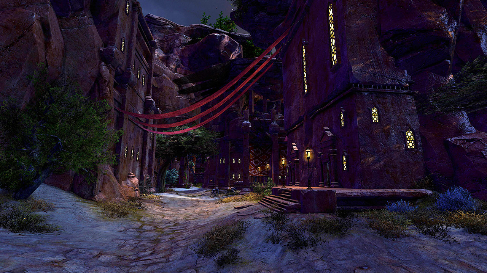
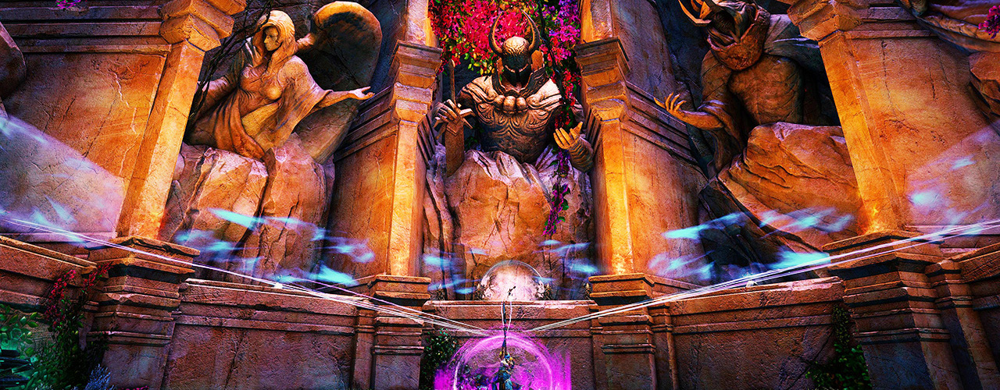
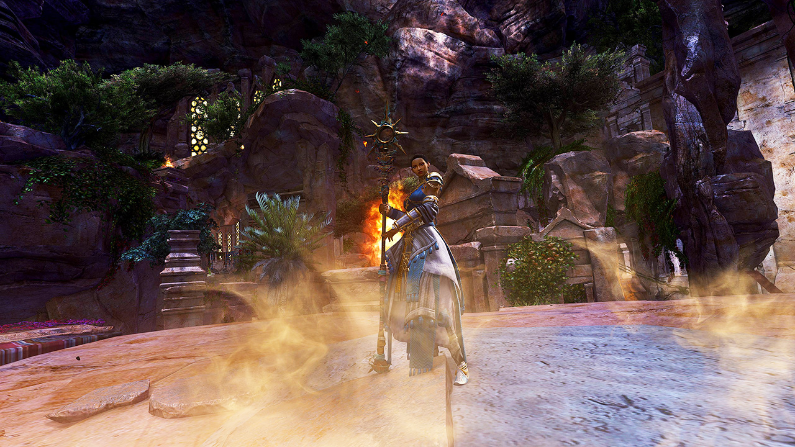
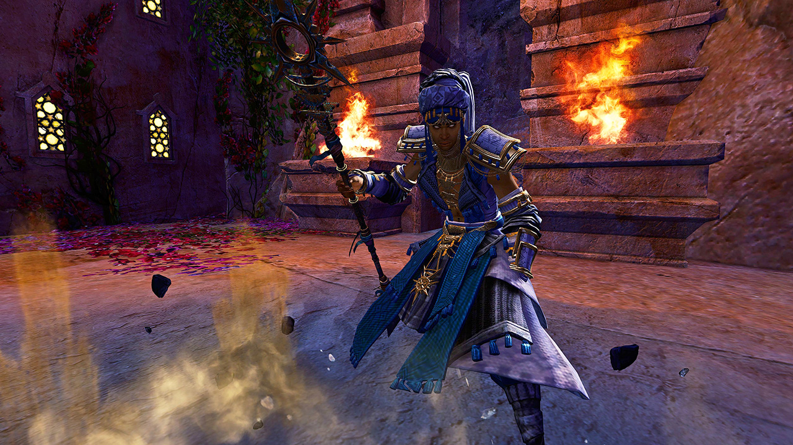
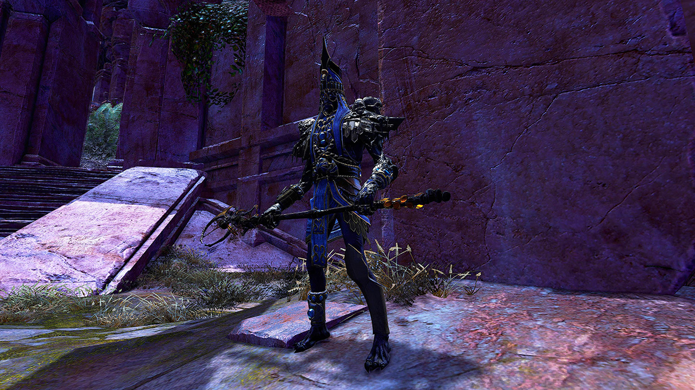
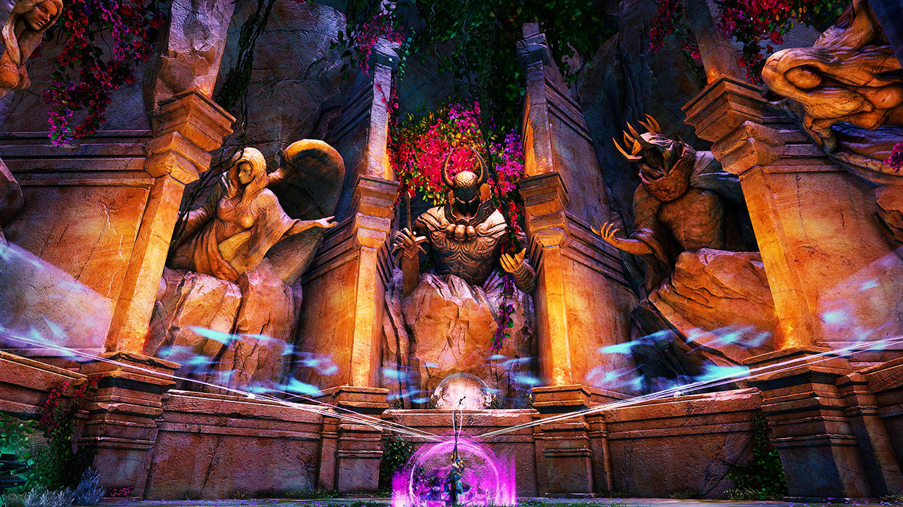

<Grid>
<GridItem sm="7">

## Start: Run!

Let your <Specialization name="Renegade"/> skip the first part or use <Effect name="Stealth"/> to skip past the initial Sunspears (as well as any further groups of Sunspears) and head to the first of the Sandbinders. If the instabilities are harder to deal with, a party may decide to take the time to kill the adds on the way, however, this will take a long time.

Use Boons like <Boon name="Swiftness"/>, <Effect name="Superspeed"/> and <Item name="executioneraxetoy"/> help to quickly skip to the first _Sand Binder_.

</GridItem>

<GridItem sm="5">

<Tabs>
<Tab specialization="Soulbeast">
Use <Skill id="31568"/> from your Smokescale pet to stack <Effect name="Stealth"/>.
</Tab>

<Tab specialization="Weaver">
It is worth to run <Skill name="arcane wave"/> for the whole fractal for more <Boon name="Might"/>, since you can't really stack anywhere.
</Tab>

<Tab specialization="Daredevil">
Use the smoke field from <Skill id="13113"/> or <Skill id="13065"/> or simply cast <Skill id="13117"/> to stack <Effect name="Stealth"/>.
</Tab>

<Tab specialization="Renegade">
<ProfessionVideo title="Portal skip" profession="Renegade" src="xHeZuQ5zWMU"/>

You can skip this first part with <Item id="78978"/>.
</Tab>
</Tabs>
</GridItem>
</Grid>

---

## First Sandbinder

Treat each Sandbinder like any immobile boss and attack accordingly. Keep in mind that <Control name="Pull"/> abilities will cancel any attack currently executing. Try to avoid the _Tornadoes_ as they take control of your character and also <Condition name="Blinded"/>. <Boon name="Aegis"/> is not helpful here as the _Tornadoes_ quickly remove it.

After you killed the Sandbinder you can use `/gg` to reset the <Item id="78978"/> and <Specialization name="Berserker"/>'s cooldowns for the Amala fight.

---

<Grid>
<GridItem sm="4">

</GridItem>

<GridItem sm="8">

## Priestess Amala (Basic)

Next up you will encounter Priestess Amala for the first time, bring her to 75% health and she wipes your party to praise Joko.

She uses the _Scythe Slash_ attack (causes <Control name="Knockback"/>) and a basic version of her 9-part attack chain applying <Condition name="Bleeding"/> with each AoE.

You can freely use `/gg` after the roleplay starts to reset cooldowns. Note that you will not be able to move your character until Joko resurrects Amala or your character is female (human female is meta afterall).

</GridItem>
</Grid>

---

## "Storm the Rooftops!"

<Grid>
<GridItem sm="7">

Now that you're awakened, you gain access to a new special action skill which launches you high into the air and breaks <Control name="Stun"/>. It doesn't have a cooldown out of combat so do not get in fight during skips if possible.

It can also be used to jump while casting any skill that requires you to stand still otherwise, as long as you do not move in any direction (<Skill id="5501" profession="Weaver"/> and similar skills).

Jump up to the roof on the right-hand side and kill two Sandbinders on the roofs. The first is a copy of the Sandbinder you fought at the beginning, the second one also uses Dwayna's _Lightning Storm_ (strafe sideways from allies to avoid it).

It is also possible to skip the tornado between the two Sandbinder using this portal skip shown below.

<Warning>
Please note that you can't `/gg` after any Sandbinder, because you spawn behind the ideal checkpoints.
</Warning>

<Tabs>
<Tab title="Slower skip">
<ProfessionVideo title="Slower skip (any class)" profession="Guardian" timestamp="306" src="MmJTsOhdQeo"/>
</Tab>

<Tab title="Faster skip">
<ProfessionVideo title="Faster skip (any class)" profession="Guardian" timestamp="341" src="MmJTsOhdQeo"/>
</Tab>
</Tabs>
</GridItem>

<GridItem sm="5">

</GridItem>
</Grid>

---

## Priestess Amala

<Warning>
**Bring boon strips because she is reapplying <Boon name="Protection"/> on herself every few seconds**
</Warning>

Stack <Boon name="Might"/> and be ready to dodge the initial <Control name="Knockback"/> after activating the encounter.

<Grid>
<GridItem sm="9">

### Permanent Mechanics

|                                     |                                                                                                                                                                                          |
| ----------------------------------- | ---------------------------------------------------------------------------------------------------------------------------------------------------------------------------------------- |
| **Breakbars**                       | A breakbar will occur at 85, 65, 45, 25 and 5% health. Amala will cancel any ability and teleport to the middle, break her bar or she deals high damage to the team and recovers health. |
| **Scythe Slash**                    | A small AoE centered around Amala that will <Control name="Knockback"/> players hit by it.                                                                                               |
| **Scythe Combo** (below 85% health) | A 9-part attack chain dealing AoE in a fixed pattern, depending on the current god incorporation.                                                                                        |
| **Energy Wave** (below 85% health)  | This attack is telegraphed by a small AoE on the ground, which then erupts into a large shockwave after 2.5 seconds. This can be avoided by either dodging, blocking or using SAK.       |

</GridItem>

<GridItem sm="3">

</GridItem>
</Grid>

### Lyssa <Label>100%-85%</Label>

First off, figure out which out of all the clones is the real Amala and ping her for the other players.There are a few tells to help you:

- Amala herself is the only Legendary rank enemy, other clones are above level 80
- She uses _Scythe Slash_ when someone is in melee range
- When she uses her _Moa Signet_, the <Skill id="29519"/> icon will appear above her

The player targeted by the _Moa Signet_ should use the special action key the moment it completes to prevent others from being transformed.

When Amala drops below 95% health she will begin teleporting around, making new clones whenever she does so. Using the change target key (usually `TAB`) will automatically target her if she is in your line of sight. Try to step around the purple portals on the ground so you avoid being teleported up in the air.

Break Amala's defiance bar to continue to the next phase.

#### Priestess of Lyssa

Amala turns invulnerable and leaves a _Priestess of Lyssa_ behind who uses the same purple portals and Moa signet. Burst her down quickly to avoid taking high enrage damage from her clones.

### Melandru <Label>85%-65%</Label>

The biggest danger of this phase is the _Earth Elemental_, which has a multitude of control effects it applies in AoEs. While killing it is possible this is hardly an effective option, so you can either get the player it fixates on to run off the party stack, or use blocks and evades as necessary to avoid its attacks. Be aware that its _Boulder Throw_ projectile can be reflected.

In this phase, Amala's **Scythe Combo** AoEs apply a small <Control name="Knockback"/>, but many of them can be avoided by stacking directly on her. Make sure to dodge the _Eruption_ (delayed AoE appearing below random players) and ring-shaped attacks, as they <Control name="Knockdown"/> as well.

#### Priestess of Melandru

This priestess will cast a rectangular AoE between herself and Amala, avoid running over them so they don't <Control name="Knockback"/> you away from the priestess' alcove. The priestess will also use Avatar of Melandru to gain <Boon name="Stability"/> and inflict <Condition name="Immobile"/>. Similar to Amala, two smaller _Earth Elementals_ will spawn to to protect her.

### Dwayna <Label>65%-45%</Label>

Amala will periodically gain <Boon name="Swiftness"/>, <Boon name="Aegis"/>, <Boon name="Protection"/> and <Boon name="Might"/> (10x) throughout this phase, with one application every 10 seconds. Additionally, at this stage of the fight all members of the party are given the Determination buff - should you slay the Priestess of Dwayna, all party members will be revived.

In this phase, Amala's **Scythe Combo** AoEs apply a short <Control name="Daze"/> and a stack of <Condition name="Bleeding"/>.

There are far more attacks that occur directly on top of Amala in this phase, but there is less incoming CC so they can be healed through in general. The group will still need to spread out during the _Lightning Storm_ attack as it cannot be blocked with <Boon name="Aegis"/>.

After Amala drops to 60% health, she will start summoning five tornadoes. Much like the ones summoned by the Sandbinders, they will draw your character toward their center and apply damage and <Condition name="Blinded"/> to those inside of their AoE.

#### Priestess of Dwayna

The Priestess of Dwayna only has one attack which cannot be interrupted: a different iteration of the Lightning Strikes attack. Unlike Amala's, these strikes will land randomly, so the best way to deal with them is to remain near the edge of the alcove where you're less likely to be hit. Also be aware that when engaged the priestess gains <Boon name="Resolution"/>, <Boon name="Protection"/> and <Boon name="regeneration"/>.

### Grenth <Label>45%-25%</Label>

Amala will periodically gain <Boon name="Swiftness"/> and <Boon name="Might"/> (15x) during this phase while dealing <Condition name="Poisoned"/>, <Condition name="Torment"/> and <Condition name="Chilled"/> with her scythe attack chain.

This is another phase that for the most part can be stacked and DPSd through, as it has very little CC involved. The biggest danger of this phase however is the _Claim Soul_ attack, recognizable by a small orange AoE - it is unblockable and will immediately send you into downed state.

At 40% health, Amala summons an arrangement of _Spectral Walls_ that box you into the middle. Touching these walls will <Condition name="fear"/> you away from Amala.

#### Priestess of Grenth

The next priestess applies <Condition name="Bleeding"/>, <Condition name="crippled"/>, <Condition name="Poisoned"/>, <Condition name="Torment"/> and <Condition name="Chilled"/> but shouldn't be a problem to kill.

### Balthazar <Label>25%-5%</Label>

During this phase, Amala will periodically receive <Boon name="Protection"/>, <Boon name="Swiftness"/> and <Boon name="Might"/> (10x).

While for the most part Amala's attacks can be healed through this phase, some of her attacks are devastating as they have large telegraphs like _Meteor Strike_ and _Wings of Rage_. As such, try to reposition out of AoEs as necessary.

Do not try to tank her _Fire Arrows_ (telegraphed by a circle AoE on top of her with arrows pointing out) as this does extreme damage if you're hit by each subsequent arrow AoE.

#### Priestess of Balthazar

This priestess doesn't do much outside of calling down small meteors which <Control name="Stun"/> and apply <Condition name="Burning"/> and <Condition name="weakness"/> on impact. Her life is tied to the four _Veteran Sunspear Warriors_ that flank her, control those with CC and kill them to eliminate the priestess.

### "Perish With Me Traitors!" <Label>5%-0%</Label>

For the final 5% health, Amala will continue to use all of the attacks from the Balthazar phase with additional small meteors striking the surrounding area. Finish her off to complete the fractal.
