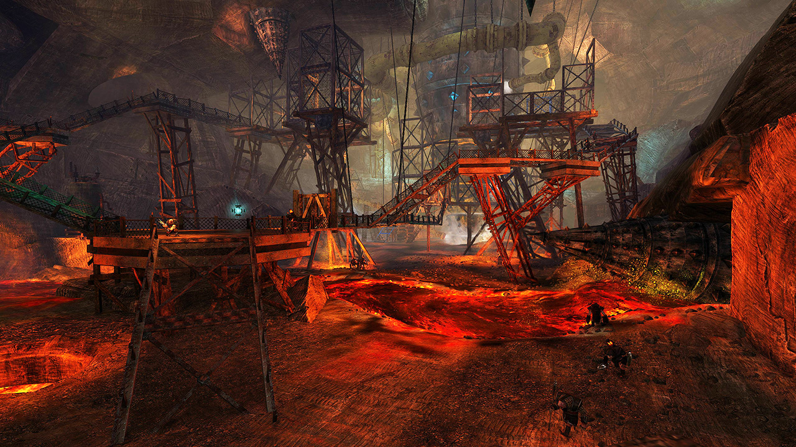
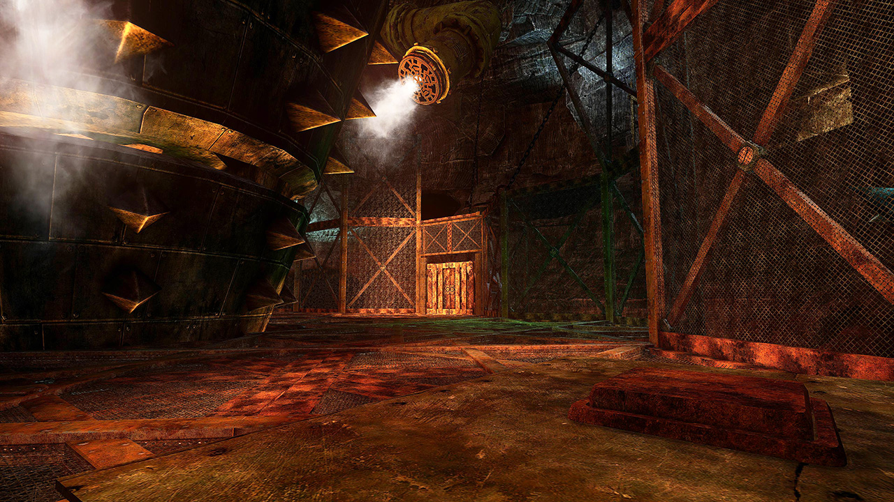
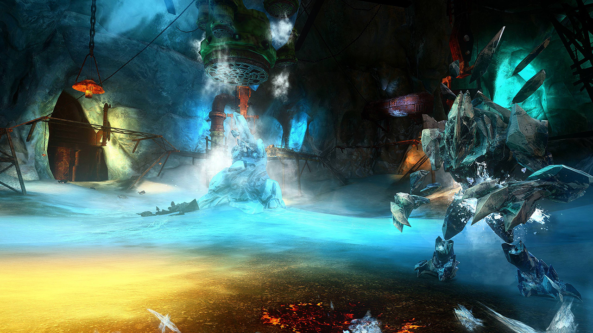

## Start: Locked Gates <Item id="8892" disableText/><Item id="24684" disableText/>

<Grid>
<GridItem sm="7">

<Warning>
There are two ways to do this. The fast one requires a <Item id="78978"/> and some jumping skills. The second one requires more team coordination and awareness.
</Warning>

<Divider text="Fast way"/>

<Tabs>
<Tab specialization="Guardian">
<ProfessionVideo title="Portal into the cage (variant 1)" profession="Guardian" src="N5RcWdIbIRs"/>
<ProfessionVideo title="Portal into the cage (variant 2)" profession="Guardian" src="Nzi7wRSNY7Q"/>
</Tab>

<Tab specialization="Warrior">
<ProfessionVideo title="Portal past the first gate" profession="Warrior" timestamp="105" src="REnmbN7sZFQ"/>
</Tab>

<Tab specialization="Revenant">
<ProfessionVideo title="Portal past the first gate" profession="Renegade" timestamp="144" src="REnmbN7sZFQ"/>
</Tab>

<Tab specialization="Thief">
<ProfessionVideo title="Portal into the cage" profession="Thief" timestamp="484" src="Alpgs_GaZV0"/>
</Tab>
</Tabs>

</GridItem>

<GridItem sm="5">

</GridItem>
</Grid>

<Divider text="Normal way (slower)"/>

|                               |                                                                                                                                                                                                                                                                                                                                                                                                                                                                                                                                                                                                                                                                                                                                       |
| ----------------------------- | ------------------------------------------------------------------------------------------------------------------------------------------------------------------------------------------------------------------------------------------------------------------------------------------------------------------------------------------------------------------------------------------------------------------------------------------------------------------------------------------------------------------------------------------------------------------------------------------------------------------------------------------------------------------------------------------------------------------------------------- |
| **Preparation**               | The best way - as usual - is to stack <Effect name="Stealth"/> on the platform before jumping down and not killing a single mob. Clarify this before running ahead and assign people for the roles below. Standing on the first pressure plate grants access to the second pressure plate, the second pressure plate grants access to the console room and the two pressure plates in the console room grant access to the console locker. A player needs about 20 seconds to activate the final console without interruption.                                                                                                                                                                                                        |
| **The First Pressure Plate**  | The best option is to let the most 'useless' class walk up with a little head start (usually the <Specialization name="Warrior"/>). The rest of the party should keep <Effect name="Stealth"/> up and run through the open gate below immediately.                                                                                                                                                                                                                                                                                                                                                                                                                                                                                    |
| **The Second Pressure Plate** | This is usually done by an <Specialization name="Elementalist"/> who teleports up from below while the others keep up <Effect name="Stealth"/>. Other option is <Specialization name="Thief"/> who can even come back easily for the console room using <Skill id="13106"/> or <Skill id="10197"/> respectively. **Activating the second pressure plate permanently opens the first door.**                                                                                                                                                                                                                                                                                                                                           |
| **The Console Room**          | Two people without special abilities should step on the two pressure plates to open the console locker. They are also responsible for keeping aggro from the opener, especially the spawning _Veteran Dredge_ next to the locker. Now for the actual console, <Item id="8686"/> and other <Effect name="Stealth"/> sources are very strong. It should be activated by someone who's able to block the <Control name="Knockback"/> from the locker closing, so the other two people can step off the pressure plates and protect the opener from the spawning mobs. The opener should indicate the step off in chat to time it with block skills. **The whole party can do `/gg` after the console is done, but it is not necessary**. |

<Tabs>
<Tab specialization="elementalist">
Take <Skill id="5536"/> or <Skill id="5641"/> when activating the console.
</Tab>

<Tab specialization="Guardian">
Use <Skill id="30029"/>, <Skill id="9084"/> and <Skill id="9253"/> block the console <Control name="Knockback"/>.
</Tab>

<Tab specialization="thief">
Use the smoke field from <Skill id="13113"/> or <Skill id="13065"/> to stack <Effect name="Stealth"/>. <Skill id="13027"/> and <Skill id="13117"/> combined with <Trait id="1136"/> provide enough <Effect name="Stealth"/> to completely activate the console.
</Tab>

<Tab specialization="ranger">

Use <Skill id="31568"/> from your Smokescale pet to stack <Effect name="Stealth"/>.
</Tab>

<Tab specialization="Renegade">
Use <Skill name="Inspiring Reinforcement"/> to block the <Control name="Knockback"/> from the console doors closing, and then protect yourself with <Skill name="Protective Solace"/> until the door is open.
</Tab>
</Tabs>

---

## Rifles _or_ Bombs path <Item id="8892" disableText/><Item id="24684" disableText/><Label>Random</Label>

<Grid>
<GridItem sm="8">

After resurrecting, skip the mobs with <Effect name="Stealth"/> and the guns or nine bombs to destroy the gate.

On the **rifles** path you lose all your endurance and therefore you are unable to dodge. Walk to the gate with an equipped rifle and avoid the orange AoEs on the ramp. If you get hit by an AoE the rifle is no longer usable and you have to pick up a new one. Use the rifle skill 1 to damage the gate. Note that using a portal with a new rifle causes it to become unusable. **Only use a portal to get back from the gate.**

On the **bombs** path, be sure to take the _Concealing Dust_ at the begin **and** at the end to permanently keep <Effect name="Stealth"/> up on yourself. Same applies if you gain aggro of any mob, just walk into a <Effect name="Stealth"/> zone.

<Warning>

**You can use portals and blinks/teleports with bombs**

</Warning>
</GridItem>

<GridItem sm="4">

<Tabs>
<Tab specialization="thief">
Cast <Skill id="13117"/> for immediate <Effect name="Stealth"/>.
</Tab>
</Tabs>
</GridItem>
</Grid>

---

## Champion Rabsovich <Item id="8892" disableText/><Item id="24684" disableText/>

When you destroy the door, you will reach _Champion Rabsovich_. Break his defiance bar as often as possible. This boss has an annoying mechanic where he interrupts every incoming attack for a couple seconds. There is no way to circumvent that.

The party should `/gg` afterwards to reset cooldowns in preparation for the skip to the endboss:

<Tabs>
<Tab specialization="Guardian">
<ProfessionVideo title="Skip to last boss, same for Ranger and Warrior" profession="Guardian" timestamp="103" src="MmJTsOhdQeo"/>
</Tab>

<Tab specialization="Thief">
<ProfessionVideo title="Thief skip to last boss" profession="Thief" timestamp="531" src="Alpgs_GaZV0"/>
</Tab>
</Tabs>

---

## Dredge Powersuit <Item id="8892" disableText/><Item id="24684" disableText/> _or_ Rampaging Ice Elemental <Item id="8885" disableText/><Item id="24661" disableText/><Label>Random</Label>

<Grid>
<GridItem sm="7">

If you did not skip, stack <Effect name="Stealth"/> and skip towards the Endboss together.

After loosing potential aggro of the mobs from the corridor, pull the boss to the next lava bucket, trigger it to inflict _Superheated_ for 10x damage and nuke. Stay on the boss as long as possible before moving to the next bucket but pay attention to his _Mending_ heal skill, which can be interrupted by simply attacking him as long as the Superheated debuff is up.

The most deadly skills here are the _Bombs_ from the Dredge Powersuit (they spawn slightly away from him) and _Shatterstone_ (dropping ice shards on every player) and _Freeze Row_ from the Ice Elemental (small delayed Ice-AoEs in a V-Shape which explode after 2.75s - unblockable).
</GridItem>

<GridItem sm="5">

<Tabs>

<Tab specialization="thief">

Teleport to the lava buckets from below with <Skill id="13025"/>.
</Tab>
</Tabs>

</GridItem>
</Grid>

