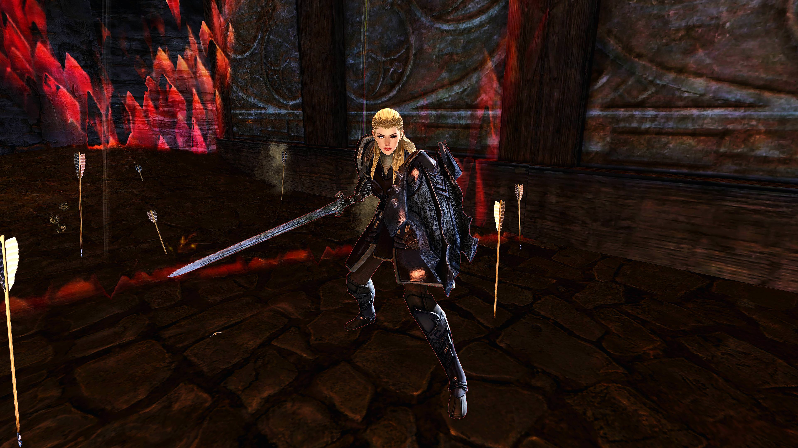
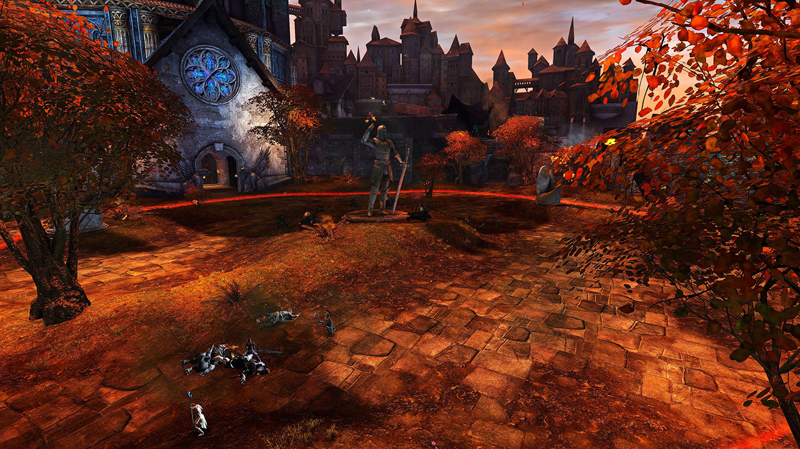

<Grid>
<GridItem sm="6">

</GridItem>

<GridItem sm="6">

## Siegemaster Dulfy

Stack <Effect name="Stealth"/> in the tent and run towards Dulfy.

Killing the _Burning Oil_ above her is your highest priority. Control and cleave the trash mobs and utilize reflects and blocks while nuking her down. Destroy the gate after finishing her and gather on the other side of the wall.
</GridItem>

<GridItem sm="12">
<Tabs>
<Tab specialization="elementalist">
If you are the first Weaver at the gate and still have <Effect name="Stealth"/>, cast <Skill id="5501"/> on the Burning Oil above Dulfy. At least one weaver should use <Skill id="5738"/> on the mobs and Dulfy. You can use <Skill id="5697"/> against the door for more damage. Use <Skill id="22572"/> for better cleave.
</Tab>

<Tab specialization="ranger">
Use <Skill id="31568"/> from your Smokescale pet to stack <Effect name="Stealth"/> at the beginning.
</Tab>

<Tab specialization="thief">
Use the smoke field from <Skill id="13113"/> or <Skill name="Smoke Screen" profession="thief"/> (also useful for reflects) or simply cast <Skill id="13117"/> to stack <Effect name="Stealth"/>.
</Tab>

<Tab specialization="Renegade">
Legend choices:
1. <Skill name="Legendary Dwarf Stance"/> to have access to <Skill name="Inspiring Reinforcement"/> for <Boon name="Stability"/>.
2. <Skill name="Legendary Centaur Stance"/> for <Skill name="Protective Solace"/> for the multiple different projectiles knocking you down and occasional condition cleanse for <Condition name="Burning"/>.
3. <Skill name="Legendary Assassin Stance"/> if neither of the aforementioned choices are relevant for your group.
</Tab>
</Tabs>

</GridItem>
</Grid>

---

## The town

<Grid>
<GridItem sm="6">
Again, stack <Effect name="Stealth"/> and skip past all the mob groups. Plan ahead to not run into any obstacles. Gather after reaching the courtyard.

Note that there is a little jumping puzzle in case you are unlucky with barricades spawning, check out [this video](https://www.youtube.com/watch?v=d5uTRJ9iyEY) for reference. Using <Item id="8764"/> and <Item id="8801"/> also helps not aggroing the guards nearby. Watch out for the chicken that spawns there for an achievement (it is random if it's there or not), putting you in combat using the items, thus not being able to pull off the skip.

<Tabs>
<Tab specialization="thief">
Use the smoke field from <Skill id="13113"/> or <Skill id="13065"/> or simply cast <Skill id="13117"/> to stack <Effect name="Stealth"/>.
</Tab>

<Tab specialization="ranger">
Use <Skill id="31568"/> from your Smokescale pet to stack <Effect name="Stealth"/>.
</Tab>
</Tabs>

</GridItem>

<GridItem sm="6">

</GridItem>
</Grid>

---

<Grid>

<GridItem sm="6">

## Courtyard

To capture the courtyard, you have to kill (or kite away) four groups of _Veteran Ascalonians_.

As soon as you capture the courtyard, the _Fire Caller_ will start a ritual and enemy groups spawn at the gates (clockwise starting north).

</GridItem>

<GridItem sm="6">
<Tabs>
<Tab specialization="Renegade">
For more experienced groups it is favorable to take <Skill name="Legendary Dwarf Stance"/> and go into the middle and casting <Skill name="Inspiring reinforcement"/> for <Boon name="Stability"/> against <Control name="Knockback"/> and <Control name="Daze"/> and <Skill name="Rite of the Great Dwarf"/> for damage reduction.
</Tab>

<Tab specialization="elementalist">
The <Skill id="5738"/> is very strong against the groups of mobs during the capture event. <Skill id="5671"/> and <Skill id="5683"/> prevent the enemy warriors _Rush_ attack. Stay in <Skill id="5492"/> before Ashym for <Boon name="Might"/> stacking.
</Tab>
</Tabs>
</GridItem>
</Grid>

## Captain Ashym

Stack <Boon name="Might"/> while Captain Ashym runs towards you. Break his defiance bar as frequent as possible and be careful with his _Meteor Shower_ AoE skill. He also tends to block multiple times during the fight, stop wasting your skills in that case.

Also pay attention to his boons as <Boon name="Resolution"/> deals high damage to yourself. At 25% health, he will equip a _Fiery Greatsword_ and gain additional skills, just make sure to end the fight quickly.
