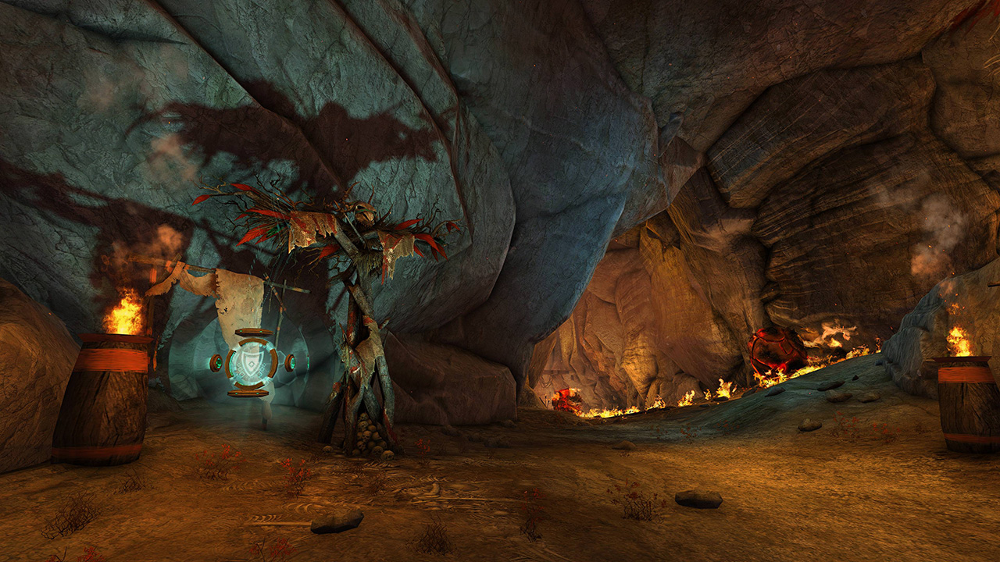
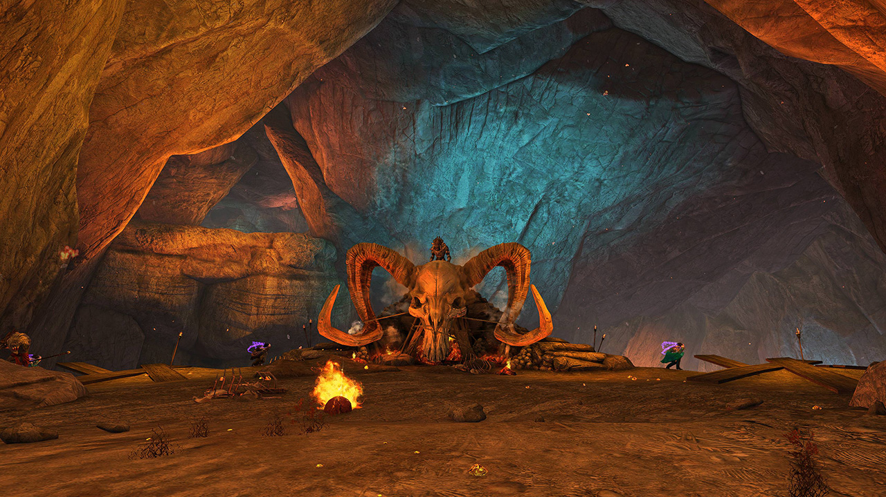
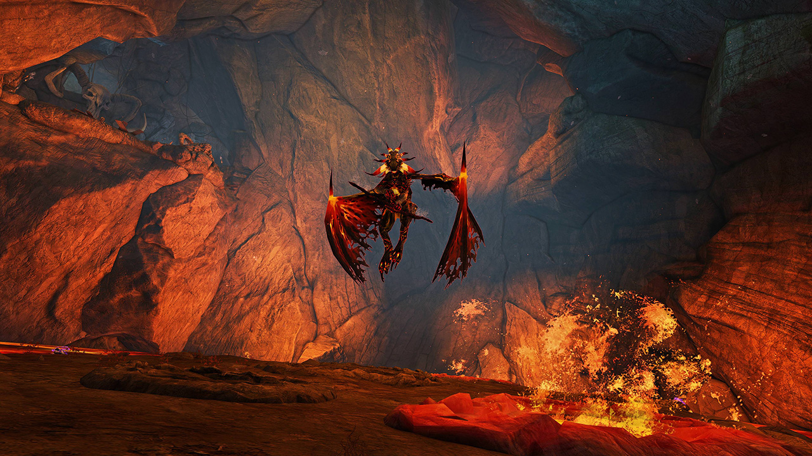

## Start: Grawl slaughter! <Item id="8890" disableText/><Item id="24648" disableText/>

At the start of the fractal four grawls have to be killed in order to start the first event. Use <Control name="Pull"/>s to group them up and quickly burst them down.

The next event requires to fill up a progress bar. For every grawl killed the party gains progress. Note, that the grawls always spawn in groups and can be attacked before they are visible. They always spawn at the same spots, so you can focus AoE damage on these spots.

While four people kill the respawning Grawls to fill the progress bar, one person (usually the <Specialization name="Renegade"/> but anyone can) should run ahead to the next area and trigger the checkpoint at the _Grawl Shaman_. This way, everyone can portal after the section is completed and resurrect to skip the Boulder passage.

<Grid>
 
<GridItem xs="12" sm="6">

</GridItem>

<GridItem xs="12" sm="6">
<Tabs>
<Tab specialization="Guardian">
<ProfessionVideo title="Skip to 2nd encounter" profession="Guardian" timestamp="403" src="MmJTsOhdQeo"/>
</Tab>

<Tab specialization="ranger">
<ProfessionVideo title="Skip to 2nd encounter" profession="Ranger" timestamp="202" src="3Zc_ZJqPD0s"/>
</Tab>

<Tab specialization="Warrior">
The <Specialization name="Berserker"/> can equip a greatsword and <Skill name="bloodreckoning"/> for 2x <Skill name="arcdivider"/>!
<ProfessionVideo title="Skip to 2nd encounter" profession="Warrior" timestamp="45" src="REnmbN7sZFQ"/>
</Tab>

<Tab specialization="Weaver">
The <Specialization name="Elementalist"/> can precast strong DPS skills like <Skill id="5737"/> and <Skill id="5501"/> on the spawn locations of the Grawls, since the mobs take damage seconds before they actually appear. You can use <Skill id="5738"/> to reduce incoming damage and <Skill id="22572"/> to cleave the adds faster.
</Tab>
</Tabs>
</GridItem>
</Grid>

---

<Grid>
<GridItem xs="12" sm="7">

## Grawl Shaman <Item id="8890" disableText/><Item id="24648" disableText/>

Kill the _Veteran Grawl Shamans_ to prevent them from sacrificing the captives. Control effects like <Control name="Stun"/> and <Condition name="Immobile"/> hinder them from reaching the edge.

You will need to throw eight _Infused Stones_ at the bubble protecting the Grawl Shaman boss to break it and make him vulnerable. The stones spawn on rockfalls, wait until the falling animation finishes and dodge into it to collect it. You can ping the Grawl Shaman (`Ctrl + T`) for easy targeting.

After the bubble is broken, stand below the boss to LoS him and he will come down immediately. Throw another _Infused Stone_ at him if his bubble reappears during the fight.

</GridItem>
<GridItem xs="12" sm="5">
<Tabs>
<Tab specialization="Weaver">
Use either <Skill id="5683"/> and <Skill id="5686"/> or <Skill id="5671"/> to keep the _Veteran Grawl Shamans_ in your <Skill id="5548"/>, <Skill id="43762"/> and <Skill id="41125"/>. If everyone LoS'ed the boss correctly, he will be close enough to <Skill id="5697"/> against the altar he stood on.
</Tab>
</Tabs>
</GridItem>
</Grid>

---

## Imbued Shaman <Item id="8886" disableText/><Item id="24868" disableText/>

<Grid>
<GridItem xs="12" sm="8">

**Take the shortcut on the right-hand side down, jump into the lava then run and jump to the final platform to trigger the next checkpoint**, then everyone uses `/gg` to reset cooldowns. Walk until the end of the boardwalk, stack <Boon name="Might"/> and jump down to the Imbued Shaman (the bat follows you to the end of the walkway, but it takes 10 or more seconds to reach it. Make sure you have the boons stacked and are on the correct weapon before the bat flies in you fire field).

Every 25% health, the boss gains a protective bubble and starts moving to a random villager. It will heal for about 20% health if it reaches their target, so break the bubble quickly by casting 40 abilities while targeting the Imbued Shaman (you actually don't have to hit him). Try to keep him in the center as the villagers are located at the edge of the area.

He will also spawn 10-20 _Lava Elementals_ during this phase, kill them fast as they cast a lot of projectiles and inflict high <Condition name="Burning"/> stacks on the team. Note that repeated jumping prevents the application of <Condition name="Burning"/> from the floor.

Avoid the _Bash_ and _Wing Buffer_ attacks (they <Control name="Knockback"/>) and utilize conditions clears & reflects to finish the fractal successfully.

</GridItem>
<GridItem xs="12" sm="4">

</GridItem>

<GridItem xs="12" sm="8">
<Tabs>
<Tab specialization="Renegade">
You have multiple options for your legend of choice:

1. <Skill name="Legendary Centaur Stance"/> helps you with the split phases and adds since you can use <Skill name="Protective Solace"/> to block their projectiles.
2. <Skill name="Legendary Demon Stance"/> will help you get <Boon name="Resistance"/> for the <Condition name="Burning"/> stacks via <Skill name="Pain Absorption"/>. Be careful, however, since there have been significant changes to <Boon name="Resistance"/> and you can kill yourself. Use <Skill name="Call to Anguish"/> to pull in the mobs during split phases.
3. <Skill name="Legendary Assassin Stance"/> will be the best choice damage-wise if your group doesn't need either of the two choices above.
</Tab>

<Tab specialization="Firebrand">
Use <Skill name="Chapter 4: Stalwart Stand"/> for party wide <Boon name="Resistance"/>, <Skill name="Chapter 3: Valiant Bulwark"/> to block enemy projectiles and <Skill name="Chapter 3: Heated Rebuke"/> to pull in the enemies.
</Tab>

<Tab specialization="Elementalist">
Take <Skill id="5507"/> for an additional condition cleanse. Use <Skill id="22572"/> to cleave the Lava Elementals faster.
</Tab>

<Tab specialization="Soulbeast">
Take <Skill id="12489"/> for pulsing condition cleanse! You can also take <Skill name="Bear stance"/> with the trait <Trait name="Leader of the Pack"/> to give the whole party condition cleanse.
</Tab>
</Tabs>
</GridItem>
</Grid>
