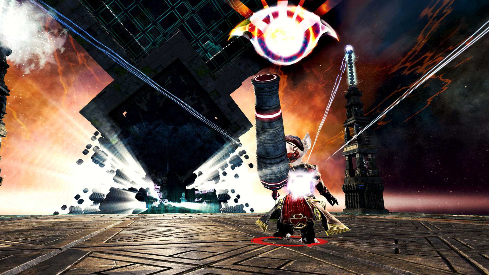

<Grid>

<GridItem>

These guides provide an in depth description on how to deal damage in CMs. Our guides merely represent a suggestion of what works decently. In an actual fight you might have to apply your profession knowledge to skip, add or alter the rotation on the fly. As you collect more experience, this will come naturally. These pages provide hints for you: for example on what weapon set you should be in which phase, what kind of CC skills you should be using. Maybe there are variations in sigils or utility skills?
</GridItem>
<GridItem>

</GridItem>
</Grid>

<Divider />

## Static Groups

For static groups that want to practice and perfection their builds.

<Information>
These guides also apply to a certain degree in PuGs
</Information>

| Build                                                                 | Type   | Link                                                   |
| --------------------------------------------------------------------- | ------ | ------------------------------------------------------ |
| <BuildLink build="Power Renegade" specialization="Renegade"/>         | Static | [guide](/cm-guides/revenant/power-renegade/static)     |
| <BuildLink build="Power Scrapper" specialization="Scrapper"/>         | Static | [guide](/cm-guides/engineer/power-scrapper/static)     |
| <BuildLink build="Power Soulbeast" specialization="Soulbeast"/>       | Static | [guide](/cm-guides/ranger/power-soulbeast/static)      |
| <BuildLink build="Power Dragonhunter" specialization="Dragonhunter"/> | Static | [guide](/cm-guides/guardian/power-dragonhunter/static) |

<Divider />

## Pick up Group Guides

This guides are meant to be applied to slower groups (what you commonly find in LFG).

| Build | Type | Link  |
| ----- | ---- | ------|
|       |      |       |

<Divider />

## Outdated Guides
<Warning>
These guides have not been updated for multiple patches. The information you find here might be outdated, irrelevant or reffering to build variations that are no longer used. However plenty of the information here is usable or can be adapted to current patch, making them worth keeping.
</Warning>

| Build                                                                 | Type   | Link                                                   |
| --------------------------------------------------------------------- | ------ | ------------------------------------------------------ |
| <BuildLink build="Power Firebrand" specialization="Firebrand"/>       | Static | [guide](/cm-guides/guardian/power-firebrand/static)    |
| <BuildLink build="Power Berserker" specialization="Berserker"/>       | Static | [guide](/cm-guides/warrior/power-berserker/static)     |
| <BuildLink build="Power Weaver" specialization="Weaver"/>             | Static | [guide](/cm-guides/elementalist/power-weaver/static)   |
| <BuildLink build="Power Soulbeast" specialization="Soulbeast"/>       | PuG    | [guide](/cm-guides/ranger/power-soulbeast/pug)         |
| <BuildLink build="Power Berserker" specialization="Berserker"/>       | PuG    | [guide](/cm-guides/warrior/power-berserker/pug)        |
| <BuildLink build="Power Reaper" specialization="Reaper"/>             | PuG    | [guide](/cm-guides/necromancer/power-reaper/pug)       |
| <BuildLink build="Power Weaver" specialization="Weaver"/>             | PuG    | [guide](/cm-guides/elementalist/power-weaver/pug)      |
| <BuildLink build="Heal Firebrand" specialization="Firebrand"/>        | PuG    | [guide](/cm-guides/guardian/heal-firebrand/pug)        |
| <BuildLink build="Power Renegade" specialization="Renegade"/>         | PuG    | [guide](/cm-guides/revenant/power-renegade/pug)         |
