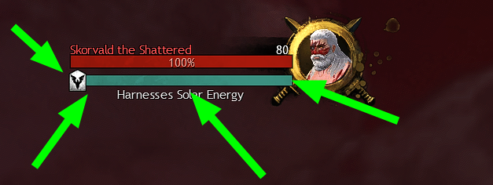
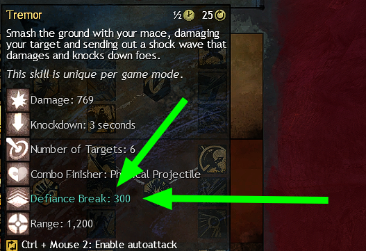

## Introduction to fractals

<Grid>

<GridItem xs="12" sm="7">

Fractals of The Mists, frequently called _"fractals"_, or simply _"fracs"_, are 5-man repeatable endgame dungeon-like instances with a large scale of difficulty and rewards. 100 levels are structured into 4 different tiers, each consisting of 25 levels.

As you move up in fractal level, the content becomes more difficult – but also more rewarding.

You can find the portal entrance to fractals in Fort Marriner in Lion's Arch. There are no gear requirements for tier 1 fractals, allowing anybody to try fractals out.

Starting at level 20, players need to deal with <Effect name="Agony"/> which requires increasing amounts of <Attribute name="Agony Resistance"/> to counter effectively as you move up in fractal level. Without enough <Attribute name="Agony Resistance"/> you lose a percentage of your HP every second while under the effect of <Effect name="Agony"/>. Click on the <Effect name="Agony"/> icon to learn more about the scaling of the damage by <Effect name="Agony"/>.

</GridItem>

<GridItem xs="12" sm="5">

</GridItem>

</Grid>

<Warning>

Be aware of <Effect name="Agony"/>; it reduces your healing and barriers by 70% per stack. Try to avoid using your heal skill while you are under the effect of <Effect name="Agony"/>.

</Warning>

Starting with tier 2, the players begin encountering _Mistlock instabilities_ which add another mechanic to play around, and therefore another layer of difficulty. By tier 4, each fractal will apply multiple _Mistlock instabilities_. A complete list of _Mistlock instabilities_ and countermeasures can be found at the bottom of this page.

---

## Defiance bars

<Grid>
<GridItem sm="9">
Have you noticed the blue bar under the boss' HP bar? Whenever you use a Crowd Control skill (a skill that throws the enemy around, stuns, or applies movement impairing conditions) a chunk of the bar gets removed. The bar is called a *defiance bar* or more commonly in pugs a *break bar*. When the entire bar is broken the boss gets the <Effect name="Exposed"/> debuff which increases the incoming damage to the boss for power damage by 10% and 20% for condition damage. **This is one of the most important mechanics across all fractals as this allows you to deal huge amounts of damage in a short time.** The idea is to always break the defiance bar and then burst. Ideally, everyone in the team contributes to breaking the bar as it appears.

Skills that damage the defiance bar are highlighted turquoise in the tooltip. Bosses have varying sizes of CC bars. Commonly, champions have a bar of the size `600`, while bosses in CM-fractals range around `2000`. However, it is important to note that the tooltips are incorrect for many skills ([list of all missing or dead](https://wiki.guildwars2.com/wiki/Defiance_Break)). Often, the displayed numbers are off by a large margin and therefore do not even serve as a rough estimate. We suggest instead consulting the [wiki](https://wiki.guildwars2.com/wiki/Defiance_bar) for finding out the exact values.
</GridItem>

<GridItem sm="3">

</GridItem>
</Grid>

<Warning>
**Using Crowd Control effectively is the key to success in almost all fractals! A fast break will decrease kill times by a large margin even if your party underperforms in every other aspect!**  
Read more about breaking Defiance bars here: [CC-distribution examples](/guides/cc-distribution)!
</Warning>

---

## Differences between fractals and raids/strikes

There are quite a few differences that set fractals apart from other PvE content in Guild Wars 2. Most prominently is the length of a single level: One level is usually completed in 5-10 minutes. The levels do not only contain bosses but also other encounters such as small puzzles or fighting mobs. These puzzles give insight into different mechanics that usually come to play during the boss fight. Many levels can be sped up by thinking outside the box and using smart tricks.

The fractal-specific potions influence the way builds are designed. Each of them grant 1.5 times of your <Attribute name="Agony Resistance"/> in a specific stat. This allows builds to be played a lot more offensive compared to elsewhere. Our [builds](/builds) are optimized for multiple amounts of <Attribute name="Agony Resistance"/> since you will acquire more than 162 <Attribute name="Agony Resistance"/> over the course of your fractal journey due to <Augmentation name="Mist Attunement 1"/> and higher augmentations.

| Potion             | Stat                              | Gain on 162 <Attribute name="Agony Resistance"/>                                |
| ------------------ | --------------------------------- | ------------------------------------------------------------------------------- |
| <Item id="71659"/> | <Attribute name="Vitality"/>      | 243 <Attribute name="Vitality"/> = 2430 <Attribute name="Health"/>              |
| <Item id="76150"/> | <Attribute name="Toughness"/>     | 243 <Attribute name="Toughness"/>                                               |
| <Item id="75427"/> | <Attribute name="Concentration"/> | 243 <Attribute name="Concentration"/> = 16.2% <Attribute name="Boon Duration"/> |

These potions are invaluable and later on starting at T3 or T4 highly recommended to use as the fractals get harder. Hover over the items to read about the other effects of each potion. Keep in mind, that each large potion grants you five stacks.

---

## Navigating the Discretize website

The Discretize website has three main categories of guides: General builds and fractals. For new players, all categories should be equally relevant.

- [General](/guides/): Learn more about the mechanics you encounter in fractals and how to deal with them.
- [Builds](/builds/): A collection of builds, which work reasonably well. Please note that the builds are incomplete due to missing contributors. The quality of the build pages is of utmost importance to us; we'd rather have fewer builds but higher quality ones, than listing only rudimentary information about all possible builds. Most build pages also contain variations. For example, there is no dedicated page for DPS Condi Firebrand, as it is played almost the same as the <Boon name="Quickness"/> version.
- [Fractals](/fractals/): An overview of each fractal including possible skips and shortcuts. Also mentions what kind of utility should be brought to mitigate damage at specific encounters.

---

## Fractal Masteries

| Name                   | Points | Description                                                                          |
| ---------------------- | ------ | ------------------------------------------------------------------------------------ |
| Follows Advice         | 1      | Unlocks daily rewards for fractals and additional vendors in the fractal lobby.      |
| Agony Channeler        | 2      | Allows attuning rings. Fractal potions grant a 10% stat bonus (see above).           |
| Recursive Resourcing   | 3      | Increases the rewards by a large margin. Fractal potions now grant a 25% stat bonus. |
| Mistlock Singularities | 5      | Unlocks _Mistlock Singularities_ for +5 <Attribute name="Agony Resistance"/>. Fractal potions now grant a 30% stat bonus.        |

---

## Tiers and Expectations

Fractals are designed to gradually introduce you to the game mode and mechanics in a relatively unpunished way in tiers 1 and 2, but become increasingly difficult and demanding on your party by tiers 3 and 4. Because of this increase in difficulty in the later tiers, the focus on team play starts to make a larger impact in every encounter. Without adapting to the difficulty scale and focusing on how an individual can best serve the party and encounter, groups may fail an encounter repeatedly or simply fall apart.

There tends to be a gap that starts to appear around T3, leading to the "T3 phenomenon"; a tier with more demand on the players meeting with players who are unaware or unwilling to adapt their build or play to meet that demand. This demand and disparity only increase in T4, making the focus on both team play and individual adaptation highly important to clear any encounter and continue improving as a player.

A key part of this adaptation includes using an appropriate build, with traits and gear stats that fit your role in the group. While gear, traits, and builds will not matter much in your first adventures in fractals, they will make a large difference in later tiers. It is advised to get a rough overview of building effective [team compositions](/guides/effective-comps) as it will increase the success rate.

While there are no hard-set rules or things you "must" bring to clear an encounter, finding the best way your character can strengthen and serve the group as you learn can help make fractals more enjoyable and satisfying to play for both yourself and your party.

| Tier | max. required <Attribute name="Agony Resistance"/> | Instabilities | Description                                                                                                                                                                                                                                                                                                                                                                                                                                                                      |
| ---- | -------------------------------------------------- | ------------- | -------------------------------------------------------------------------------------------------------------------------------------------------------------------------------------------------------------------------------------------------------------------------------------------------------------------------------------------------------------------------------------------------------------------------------------------------------------------------------- |
| 1    | 17                                                 | 0             | This tier is meant as an introduction to fractals. Mechanics and incoming damage are very forgiving. Group DPS requirements are low. The only recommendation is to have at least full exotic gear.                                                                                                                                                                                                                                                                               |
| 2    | 61                                                 | 1             | Tier 2 fractals should be played in a full party of 5. The mechanics hit slightly harder, and bosses and mobs have increased health, requiring more DPS to effectively clear. The party begins to encounter mistlock instabilities and <Effect name="Agony"/>.                                                                                                                                                                                                                   |
| 3    | 106                                                | 2             | Tier 3 fractals introduce 2 mistlock instabilities at once, while also increasing the damage from mobs and the number of mechanics. The mechanics are less forgiving, and the group will need higher DPS to effectively clear. When starting in tier 3 fractals you are expected to have some knowledge about your class and how fractals work. You will no doubt start learning more advanced tactics and how to adapt to more demanding encounters here, preparing you for T4. |
| 4    | 150                                                | 3             | When running tier 4 fractals you should be confident with both your class and the mechanics of the fractal. T4 groups will expect you to play your part and adapt to help the group however possible. Key boons become a requirement to effectively clear the content. Running with optimal utility and food as well as fractal potions (<Item id="71659" disableText/>, <Item id="76150" disableText/>, <Item id="75427" disableText/>) is expected.                            |

---

## Trouble finding groups? Looking for training runs?

<Grid>

<GridItem sm="1" md="1">

</GridItem>
<GridItem sm="11" md="11">

Guild Wars 2 University is a discord-server-based community that focuses on helping and guiding new and returning players to learn everything that Guild Wars 2 has to offer. GWU provides a friendly and judgment-free environment where veterans from all areas of the game help teach and train anyone interested in learning.

For more information, check out their [Discord](https://discord.gg/kzQdtpSxq6)

</GridItem>

</Grid>

---

## External tools

Players use several tools/add-ons to analyze gameplay more efficiently. Here is a list of common tools:

1. [arcdps](https://www.deltaconnected.com/arcdps/): DPS meter. Almost everybody uses it, no one has gotten banned for using it.
2. [log manager](https://gw2scratch.com/tools/manager): helps you organize your logs, which can be optionally recorded by arc DPS.
3. [gw2wingman](https://gw2wingman.nevermindcreations.de/home): compare your performance against the averages of the community
4. [Fractal farming](https://fast.farming-community.eu/instances/fractals) by [fast]: find out which fractals are best to farm; which daily fractals reward the most
5. [Killproof.me](https://killproof.me/): Website for sharing your killproof for raids/fractals/strikes.

---

## Acquiring gear to counter <Effect name="Agony"/>

Gearing your first character can be expensive, especially for fractals, which will eventually require a full set of ascended gear to gain enough <Attribute name="Agony Resistance"/> for most people. This is partly why it is recommended to start gearing a build with usable stats from the beginning, as it will serve you on your entire fractal journey.

For beginners, it is recommended to socket only <Item id="49432"/> in infusion slots of ascended gear since they are the most efficient ones to use and the [builds](/builds) on this website are optimized for having all 18 infusion slots occupied with <Item id="49432"/> to reach 162 <Attribute name="Agony Resistance"/>. In case you are tight on money you can also slot <Item id="49430"/> and upgrade them later by extracting them with <Item id="76409"/>. keep in mind that each extraction will cost 24 silver.

For a temporary 15 <Attribute name="Agony Resistance"/> buff, you can buy a <Item id="70596"/> and skip ahead of the suggested table below. We suggest acquiring most of the gear in fractals, however, you of course can buy your gear in WvW or open world or any other place.

---

### Tier 1: max 17 <Attribute name="Agony Resistance"/>

**Requirement**: Full exotic gear  

**Optional**: Level Chef to 400 (costs about 2.76g, check [gw2crafts.net](https://gw2crafts.net/)), craft <Item id="62921" upgrades={[49432]}/> which enables a fast track to Tier 2 fractals. Since Tier 1 and 2 are essentially identically in difficulty it is recommended to go that route, however, you will need to exchange the backpiece very soon.

Homework:

- Start working towards the accessories that you can buy with guild commendations or - if you have a lot of spare laurels - buy them for laurels. Keep in mind you need 30 laurels later for crafting your ascended armor.
- Save up relics to buy ascended rings (5 days of T1 fractal dailies are required)
- Alternatively, buy Living World Season 3 Episode 3: A Crack in the ice and farm <Item id="79899"/> for trinkets (or any other living story maps: Bloodstone fen, Dragonfall). The fastest way is to farm both Bitterfrost Frontier and Dragonfall.
- Craft <Item id="77482"/> or buy an equivalent via laurels (if your build uses base game stats)

---

### Tier 2: max 61 <Attribute name="Agony Resistance"/>

Acquire on your journey in T2:

- 18 <Attribute name="Agony Resistance"/>: Two ascended accessories of your [build](/builds) of choice. Example: <Item id="39232" upgrades={[49432]}/> and <Item id="39233" upgrades={[49432]}/>.
- 36 <Attribute name="Agony Resistance"/>: By attuning ascended rings. Example: <Item id="75187" upgrades={[49432,49432]}/> and <Item id="74440" upgrades={[49432,49432]}/>
- 9 <Attribute name="Agony Resistance"/>: Getting a back item such as: <Item id="79830" upgrades={[49432]}/>

Homework:

- Start leveling the profession for your armor class (Armorsmith, Leatherwork, Tailor) to 500. Use [gw2crafts.net](https://gw2crafts.net) for the cheapest leveling.

---

### Tier 3: max 106 <Attribute name="Agony Resistance"/>

Acquire on your journey in T3:

- You need 5 more <Item id="49432"/> to fit the maximum requirement of 106 <Attribute name="Agony Resistance"/>.
- Suggestion: craft 4 ascended armor pieces and hope to get a <Item id="38024"/> to upgrade one of your rings to <Item id="75669" upgrades={[49432,49432,49432]}/>
- Alternatively, do strike missions and open the weekly chest for a chance of receiving an ascended armor box.

Homework:

- Start leveling the profession that can craft your desired weapons to 500. Use [gw2crafts.net](https://gw2crafts.net) for the cheapest leveling.

---

### Tier 4: max 150 <Attribute name="Agony Resistance"/>

Wrapping up:

1.  Finish your ascended armor
2.  Infuse your remaining ring(s)
3.  Craft ascended weapons (easy way: [Caladbolg](https://wiki.guildwars2.com/wiki/Caladbolg_weapons) alternatively profession weapons from Path of Fire)
4.  Infuse your backpack (and/or begin working towards <Item id="74155"/>)
5.  Upgrade - if necessary - <Item id="49430"/> to <Item id="49432"/>

Congratulations! Now you should have exactly 162 <Attribute name="Agony Resistance"/> and match the gear in our [builds](/builds) page.

---

## Abbreviations for navigating the LFG
### General
These are common abbrevations, used when a group only needs a general idea of a player (e.g., we are missing a quickness healer) or when they have specific experience expectations.

| Short              | Long                    | Aliases                       | Description                                                                                                                             |
| ------------------ | ----------------------- | ----------------------------- | --------------------------------------------------------------------------------------------------------------------------------------- |
| `alac`             | Alacrity Provider       | `alacdps`, `alacheal`         | Any build that can provide <Boon name="Alacrity"/>. Could be a support or damage build, but it might be specified (e.g., _alacheal_)    |
| `quick`            | Quickness Provider      | `qheal`, `qdps`               | Any build that can provide <Boon name="Quickness"/>. Could be a support or damage build, but it might be specified (e.g., _quickdps_)   |
| `cdps`             | Condition DPS           | `dps`, `CDPS`                 | A suitable condition dps build from a class of your choice. These offer strong _condition/ticking_ damage                               |
| `pdps`             | Power DPS               | `dps`, `PDPS`                 | A suitable power dps build from a class of your choice. These offer strong _burst_ damage                                               |
| `p&f`              | Potion and Food         | `pof`, `p & f`                | You are expected both to use all three fractal potions _and_ build-specific food buffs                                                  |
| `DwD`              | Dances with Demons      | `title`, `99 title`           | Earned by completing level 99 in challenge mode with no one in your group being defeated                                                |
| `NA`               | Nightmare Aspect        | `100 title`                   | Earned by completing level 100 in challenge mode with no one in your group being defeated                                               |
| `UFE`              | Kill proof              | `kp`                          | <Item id="94020"/>: Only gained from CMs. Requirement in LFG, can be shown through [killproof.me](https://killproof.me/)                |

---

## Usage of `/gg`

<Grid>
<GridItem sm="8">

You can use the chat command `/gg` within fractals to immediately kill your character (dead, not downed). This is used generously in fractals and serves as a tool to reset to a checkpoint together or avoid unnecessary areas of content.

It is a useful tool in fractal skips, as it allows the entire party to teleport to a checkpoint once one player activates it.

It can also serve as a full skill reset in key moments. If everyone in the party is dead at the same time, cooldowns will reset for all players. Therefore it is advised for the entire group to use `/gg` at certain key positions to reset long cooldowns, like between Siax (2nd boss) and Ensolyss (3rd boss) in Nightmare CM. Never resurrect as long as another player is still alive. If another player tells you `/gg`, they are probably doing a skip that you are unaware of or they simply weren't ready for combat yet. Either way, avoid wasting time questioning it, just /gg and reset.

Note that resource bars such as <Specialization name="Warrior"/>'s Adrenaline bar, <Specialization name="Druid"/>'s <Skill id="31869"/> and <Skill name="Reapers Shroud"/> for <Specialization name="Reaper"/> will fully recharge after the resurrection. Also the _Mistlock Singularity_ resets once everyone in the party is dead.
</GridItem>

<GridItem sm="4">

</GridItem>
</Grid>

---

## Pre-stacking at Mistlock Singularity

<Grid>
<GridItem sm="12" md="2">

</GridItem>

<GridItem sm="12" md="10">
After maxing the fractal masteries to level 4 you get access to _Mistlock Singularities_. Taking one of these will reset the cooldowns of all your skills! This allows you to precast certain skills before entering the battle without a penalty. It makes sense to precast <Boon name="Quickness"/>, <Boon name="Alacrity"/> and use blast finishers on certain Combo Fields.

The most common applications are <Boon name="Might"/>-stacking using blast finishers inside a _Fire Field_ (3 stacks for 20 seconds with boon duration) and <Effect name="Stealth"/>-stacking inside a _Smoke Field_ (3 seconds).

<Warning>
Do not use other combo fields than fire on the _Mistlock Singularity_! All combo fields but the _Fire Field_ are useless in terms of prebooning.
</Warning>
</GridItem>
</Grid>

You can find out which skills are _Combo Fields_ and _Combo Finishers_ by hovering over the skill and reading the tooltip. Hover over the following skills: <Skill name="Ring of Fire"/> is a _Fire Field_ and <Skill name="Holy Strike"/> a _Blast Finisher_.  
Below is a list of frequently used blast finishers among all professions. Note that it is often required to swap to different weapons, make sure to swap back before you enter combat.

### <Boon name="Might"/> stacking for groups using <Skill name="Moa Stance"/> from <Specialization name="Soulbeast"/>.

- <Specialization name="Renegade"/>: <Skill name="Renewing Wave"/> (Staff 4)
- <Specialization name="Firebrand"/>: <Skill name="Shield of Wrath"/> (Focus 5), <Skill name="Holy Strike"/> (Staff 2), <Skill name="Hammer of Wisdom"/> and <Skill name="Mighty Blow"/> (Hammer 2)
- <Specialization name="Berserker"/>: <Skill id="14405"/> and <Skill id="14407"/> (Utility), <Skill id="14393"/> (Warhorn 4), <Skill id="14394"/> (Warhorn 5)
- <Specialization name="Weaver"/>: Use <Skill id="5692"/> (Scepter 2), <Skill id="5691"/> (Dagger 4) and <Skill id="5675"/> (Scepter 3) in <Skill id="5492" disableText/> / <Skill id="5492" disableText/>
- <Specialization name="Soulbeast"/>: Take the trait <Trait name="Leader of the Pack"/> and use <Skill name="Moa Stance"/> to make boons last longer, use <Skill id="12621"/> (Warhorn 5)

### Fire fields <Label><Boon name="Might"/> stacking</Label>

Below is a list of commonly used _Fire Field_ skills. **Make sure that everyone is back on their main weapon set before starting a fight.**

- <Specialization name="Elementalist"/>:
  - <Skill id="5548"/> (Staff 2, <Skill id="5492" disableText/>)
  - <Skill id="5691"/> (Dagger 4, <Skill id="5492" disableText/>)
  - <Skill id="5497"/> (Focus 4, <Skill id="5492" disableText/>)
  - <Skill id="29533"/> (Warhorn 5, <Skill id="5492" disableText/>, <Specialization name="Tempest" disableText/>)
- <Specialization name="Berserker"/>:
  - <Skill id="29940"/> (Torch 5)
- <Specialization name="Ranger"/>:
  - <Skill id="12504"/> (Torch 5)
- <Specialization name="Firebrand"/>:
  - <Skill name="Chapter 4: Scorched Aftermath"/> in <Skill id="44364"/>
  - <Skill id="9253"/>
- <Specialization name="Renegade"/>:
  - <Skill id="45773"/> (<Skill id="41858"/> Elite Skill)

<Grid>
<GridItem sm="12" md="6">

### Smoke fields <Label> <Effect name="Stealth"/> stacking </Label>

Be careful not to aggro mobs with blasts or you will get <Effect name="Revealed"/>.

- <Specialization name="Thief"/>:
  - <Skill id="13113"/> (Pistol 5)
  - <Skill id="13065"/>
- <Specialization name="Ranger"/>:
  - <Skill id="31568"/> (Smokescale pet)
- <Specialization name="Engineer"/>:
  - <Skill id="5824"/> (Bomb kit)

</GridItem>

<GridItem sm="12" md="6">

#### Other skills that grant party <Effect name="Stealth"/>

- <Specialization name="Mesmer"/>:
  - <Skill id="10245"/>
  - <Skill id="10187"/>
  - Double any skill with <Skill id="29830"/> (<Specialization name="Chronomancer" disableText/>)
- <Specialization name="Thief"/>:
  - <Skill id="13117"/>

</GridItem>
</Grid>

---

## Line of Sight (LoS) and stacking

<Grid>
<GridItem sm="12" md="6">

In many Fractals, the concept of "Line of Sight" or LoS can be applied to pack mobs together without using any skills that <Control name="Pull"/>. As soon as a player takes aggro of a mob it tries to attack the player. In doing so it needs to find a valid path. For enemies with melee weapons this means it will run right towards you, ranged enemies need a clear sight towards the player without obstruction. After taking aggro of a mob the player wants to move behind a wall so the mob loses Line of Sight and is forced to take the shortest path to the player.

Generally, you **always** want to stick together as a group. The reason is that boons and unique buffs won't reach players that are standing too far away. Since most classes deal high damage in melee the logical conclusion is to stack up, pull mobs together either with <Control name="Pull"/>s or Line of Sight, and burst them down as quickly as possible. **Even if the amount of enemies seems dangerous at the first glance the most secure position on the map is in the center of the stack!**
</GridItem>

<GridItem>
<GifPlayer caption="Pulling mobs by using Line of Sight" url="https://pub-80c25841bf1e4cbda246ab1b42798500.r2.dev/lospull.webm"/>
</GridItem>
</Grid>

---

## Mistlock Instabilities

<Grid>
<GridItem sm="8">
In tiers 2 to 4, the fractal will always have Mistlock Instabilities active, which add additional mechanics to the fights. The selection is random for each difficulty level and changes daily. More information can be found [on the official wiki](https://wiki.guildwars2.com/wiki/Fractals_of_the_Mists).

Below is a list of all current instabilities and their possible countermeasures.
</GridItem>

<GridItem sm="4">

</GridItem>

</Grid>

|                                           |                                                                                                                                                                                                                                                                                                                                                                                                                                                                                                                                                                                                                                                                         |
| ----------------------------------------- | ----------------------------------------------------------------------------------------------------------------------------------------------------------------------------------------------------------------------------------------------------------------------------------------------------------------------------------------------------------------------------------------------------------------------------------------------------------------------------------------------------------------------------------------------------------------------------------------------------------------------------------------------------------------------- |
| <Instability name="Adrenaline Rush"/>     | When enraged, enemies deal 100% increased damage while they're low on health (below 10%). Enemies deal 10% less damage when not enraged.                                                                                                                                                                                                                                                                                                                                                                                                                                                                                                                                 |
| <Instability name="Afflicted"/>           | Outgoing <Boon name="resistance"/> and <Boon name="resolution"/> duration is increased by 33%. Enemies apply random conditions (<Condition name="Bleeding"/>, <Condition name="Burning"/>, <Condition name="Confusion"/>, <Condition name="Poisoned"/> and <Condition name="Torment"/>). Not necessary, although a good countermeasure is to have the <Specialization name="Firebrand"/> use <Skill id="45460"/> or blasting light fields.                                                                                                                                                                                                                              |
| <Instability name="Boon Overload"/>       | Each boon on a player reduces their maximum health by 1.5%. Outgoing boon duration is increased by 20%.                                                                                                                                                                                                                                                                                                                                                                                                                                                                                                                                                                 |
| <Instability name="Flux Bomb"/>           | This means that players in combat are randomly marked with Flux Bombs which leave a damaging and blinding AoE field behind. Do not place those inside the combat area, learn to dash away right before the field deploys. If you keep walking forward while marked you won't get any damage from the bomb. Flux bombs now apply to both allies and enemies. **_It is a little DPS increase to deploy it under the boss/mobs but it is not worth it blinding your team members!_**                                                                                                                                                                                       |
| <Instability name="Fractal Vindicators"/> | Fractal Avengers are replaced by hard-hitting Fractal Vindicators. Those need to be killed as fast as possible to prevent further chaos. Unlike Avengers, the only way to remove aa Vindicator is to kill it.                                                                                                                                                                                                                                                                                                                                                                                                                                                           |
| <Instability name="Frailty"/>             | Players are smaller and take 10% more damage, but they move 25% faster.                                                                                                                                                                                                                                                                                                                                                                                                                                                                                                                                                                                                 |
| <Instability name="Hamstrung"/>           | The lower your health, the slower you move capped at 33% slower. Endurance regenerates 33% faster. Heal yourself to reduce Hamstrung stacks!                                                                                                                                                                                                                                                                                                                                                                                                                                                                                                                            |
| <Instability name="Last Laugh"/>          | Enemies explode upon death if not stunned. Each enemy killed explodes within a 180 radius 1.75 seconds after its death, dealing high damage and applying <Control name="Daze"/> to foes around it. Recognizable by a yellow zone after a mob's death. Stunned enemies apply <Boon name="Protection"/> and <Boon name="Stability"/> to nearby players.                                                                                                                                                                                                                                                                                                                   |
| <Instability name="Mists Convergence"/>   | Causes a set of effects from other fractals to spawn, including _The Mossman_, a deadly _Champion Rabbit_, _Veteran Jade Maw Tentacles_, an _airstrike_ from the PvP map Skyhammer and the _cannon assault_ from Captain Mai Trin Fractal.                                                                                                                                                                                                                                                                                                                                                                                                                              |
| <Instability name="No Pain, No Gain"/>    | Enemies receive <Boon name="Protection"/>, <Boon name="Resolution"/> and <Boon name="Might"/> when you hit them, with a 20 second internal cooldown per enemy. Anything that strips boons can be helpful here. For example, <Specialization name="Renegade"/> can strip with <Skill name="Banish Enchantment"/> (<Skill name="Legendary Demon stance"/> or <Item id="72872"/>), <Specialization name="Specter" text="Condi Specter"/> can strip with <Trait name="Bountiful Theft"/>. <Specialization name="Mesmer"/> can strip with <Skill name="Phantasmal Disenchanter"/> or Sword auto-attacks. Stripping an enemy boon will also apply the boons to nearby allies. |
| <Instability name="Outflanked"/>          | Allies within 300 range take 100% damage when attacked from behind. Non-boss enemies within a range of 300 take 100% damage when attacked from behind or the side.                                                                                                                                                                                                                                                                                                                                                                                                                                                                                                      |
| <Instability name="Social Awkwardness"/>  | Players will be pushed away from one another. Make sure to not run around like a headless chicken! Find a good spot and stand still. If you have <Boon name="Stability"/> you will not be affected.                                                                                                                                                                                                                                                                                                                                                                                                                                                                     |
| <Instability name="Stick Together"/>      | Take 25% increased damage when not within a range of 300 of an ally. Deal 5% more damage when within a range of 300 of an ally.                                                                                                                                                                                                                                                                                                                                                                                                                                                                                                                                         |
| <Instability name="Sugar Rush"/>          | Increases player movement speed and attack speed by 15%. Elite and lower enemies' movement speed and attack speed increase by 25%, but their critical chance is reduced by 25%..                                                                                                                                                                                                                                                                                                                                                                                                                                                                                        |
| <Instability name="Toxic Sickness"/>      | Players are occasionally affected by the toxic vomit attack out of the Nightmare Fractal. Every player gets a cone AoE in front of him, aiming at a party member will deal lethal damage, conditions and the debilitated effect. Proper stacking and positioning nullify this instability effectively. When the vomit attack hits an enemy it applies the <Condition name="poisoned"/>, <Condition name="torment"/>, <Condition name="confusion"/> and debilitated conditions. In fractals, debilitated decreases outgoing damage by 10% per stack, up to 30%                                                                                                           |
| <Instability name="Toxic Trail"/>         | Enemies leave a trail of poison behind them which inflicts direct damage and the <Condition name="Poisoned"/> condition. Blocking a toxic-trail attack will absorb it, cleanse the condition and apply <Condition name="Poisoned"/> to nearby enemies. It can be very dangerous when fighting multiple mobs. Removes <Boon name="Aegis"/>. This is currently bugged and does not apply <Condition name="Poisoned"/> to enemies.                                                                                                                                                                                                                                         |
| <Instability name="Vengeance"/>           | When enemies die, they enhance nearby foes with multiple boons, it does not apply to elite foes. Strip any enemy boon to inflict them with <Condition name="Weakness"/> . This is currently bugged and if you lose <Boon name="Aegis"/> it will apply <Condition name="Weakness"/> to the player.                                                                                                                                                                                                                                                                                                                                                                       |

---

## Key findings

- Don't use your heal skill while under the effect of <Effect name="Agony"/>.
- CC the boss first, then use your burst skills. **Everyone has to contribute!**
- Only use _Fire Fields_ on the _Mistlock Singularity_ during pre-stacking.
- Always stack together, boons are shared nearby.
- Don't be afraid to communicate with your team if you are new. People will help you out!

---

## Trouble finding groups?

<Grid>

<GridItem sm="1" md="1">

</GridItem>
<GridItem sm="11" md="11">

Guild Wars 2 University is a discord-server-based community that focuses on helping and guiding new and returning players to learn everything that Guild Wars 2 has to offer. GWU provides a friendly and judgment-free environment where veterans from all areas of the game help teach and train anyone interested in learning.

For more information, check out their [Discord](https://discord.gg/kzQdtpSxq6)

</GridItem>
</Grid>

If you are one of those that seek to improve beyond clearing fractals for the loot we highly encourage you to find a static via our `#looking-for-static` channel on [our discord](https://discord.gg/Qdt7nFY) or [apply to Discretize](apply). We encourage the fractal community to strive for self-improvement and help in any possible way on our discord server or in-game.
